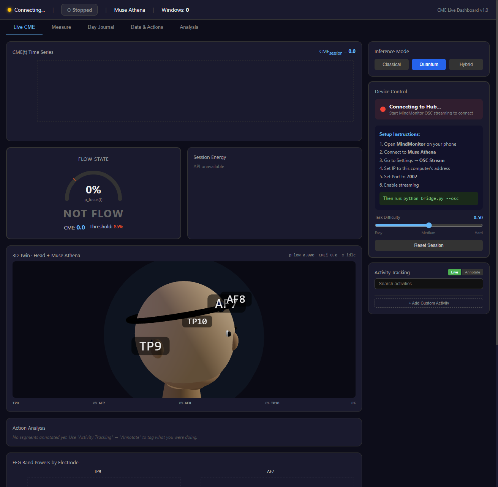
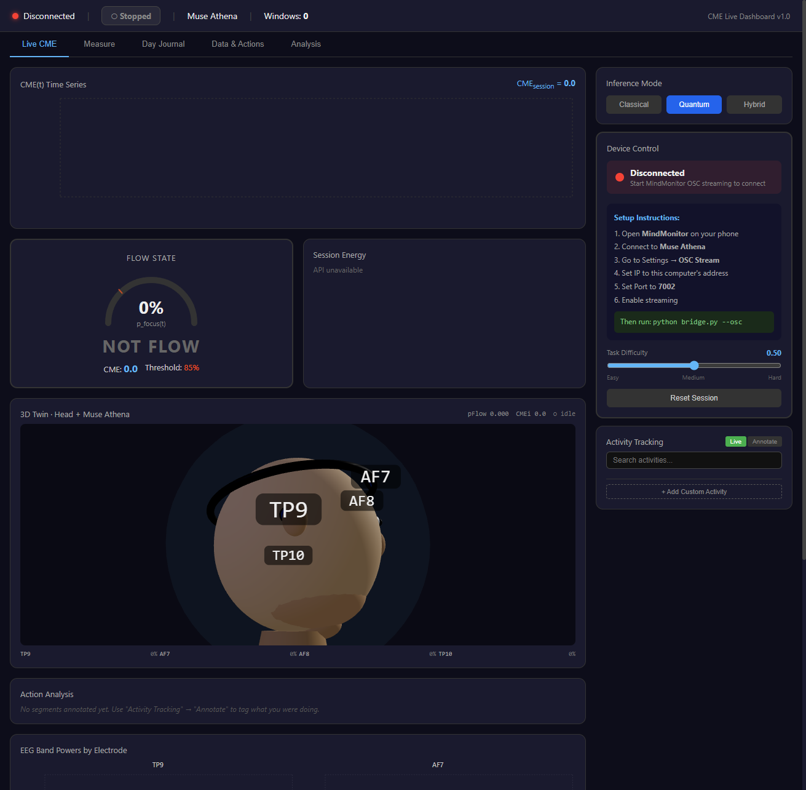
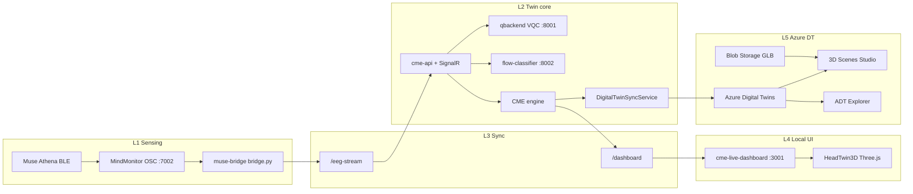
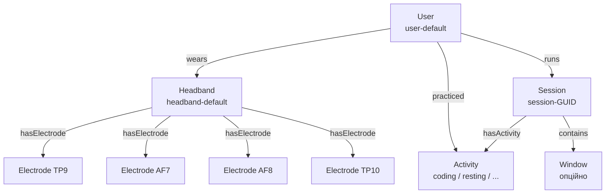
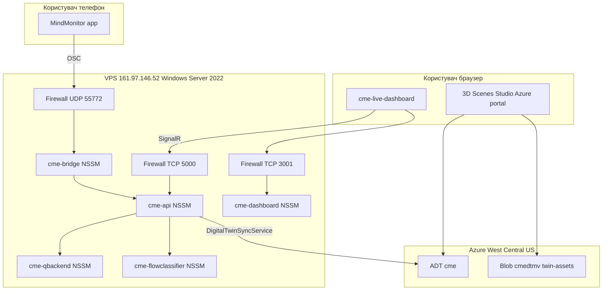

# Цифровий двійник користувача для визначення когнітивного стану на основі потокових EEG-даних

**Тема**: Комплексна лабораторна робота — Цифровий двійник
**Автор**: Михайло Вернік (Mykhailo Vernik)
**Репозиторій**: [`d-WORK/computational-mental-energy`](../README.md) (master)
**Дата здавання**: 2026-05-19
**Версія документа**: 2 (10-пунктна редакція завдання)

> Цей файл — здавальний документ за **10 пунктами** комплексної лабораторної роботи.
> Розширена методологія (12 етапів створення ЦД, формули, paper §1–6) описана у
> [docs/LAB_REPORT.md](LAB_REPORT.md); попередня 8-пунктна редакція збережена у
> [docs/LAB_SUBMISSION.md](LAB_SUBMISSION.md).

---

## Зміст

1. [Фізичний двійник](#1-фізичний-двійник)
2. [Потокові дані: апаратний шлях і симулятор](#2-потокові-дані-апаратний-шлях-і-симулятор)
3. [3D-модель фізичного двійника](#3-3d-модель-фізичного-двійника)
4. [Платформа цифрового двійника](#4-платформа-цифрового-двійника)
5. [Розробка цифрового двійника](#5-розробка-цифрового-двійника)
6. [Тестування](#6-тестування)
7. [Демонстрація та відео](#7-демонстрація-та-відео)
8. [Звіт](#8-звіт)
9. [Розгортання на GitHub](#9-розгортання-на-github)
10. [Захист лабораторної роботи](#10-захист-лабораторної-роботи)

[Висновки](#висновки) · [Додаток A — хеші](#додаток-a--хеші-артефактів) · [Додаток B — швидкий запуск](#додаток-b--швидкий-запуск-з-нуля) · [Додаток C — відкриті пункти](#додаток-c--невирішені-на-момент-здачі-пункти)

---

## Таблиця-резюме за 10 пунктами завдання

| № | Пункт завдання | Стан | Артефакт |
|---|---|---|---|
| 1 | Обрати об'єкт / процес — фізичний двійник | виконано | [§1](#1-фізичний-двійник), користувач + Muse Athena |
| 2 | Розробити програмний генератор потокових даних або використати апаратне забезпечення | виконано (обидва шляхи) | [§2](#2-потокові-дані-апаратний-шлях-і-симулятор), [muse-bridge/bridge.py](../muse-bridge/bridge.py) |
| 3 | Створити 3D-модель фізичного двійника | виконано | [§3](#3-3d-модель-фізичного-двійника), `head_with_muse.glb` |
| 4 | Обрати платформу для створення цифрового двійника | виконано | [§4](#4-платформа-цифрового-двійника), Azure Digital Twins + локальний runtime |
| 5 | Розробити цифровий двійник | виконано | [§5](#5-розробка-цифрового-двійника), 5 сервісів на VPS |
| 6 | Протестувати цифровий двійник | виконано | [§6](#6-тестування), [docs/TEST_RUNBOOK.md](TEST_RUNBOOK.md) |
| 7 | Підготувати демонстрацію та записати відео | сценарій готовий, запис — за оператором | [§7](#7-демонстрація-та-відео), [docs/demo_script.md](demo_script.md) |
| 8 | Підготувати звіт | виконано | [§8](#8-звіт), цей файл + [LAB_REPORT.md](LAB_REPORT.md) |
| 9 | Завантажити на GitHub або аналогічний ресурс розроблений проєкт | виконано | [§9](#9-розгортання-на-github) |
| 10 | Захистити комплексну лабораторну роботу | готово до захисту | [§10](#10-захист-лабораторної-роботи) |

---

## 1. Фізичний двійник

**Об'єкт**: користувач під час когнітивної діяльності (читання, програмування, лічба, відпочинок), обладнаний 4-канальним EEG-headband **Muse Athena**.

**Чому саме цей об'єкт**. Когнітивний стан — найкоротший зворотний зв'язок між «фізичним» (мозок) і «цифровим» (індекси `p(Flow)`, `CME`). Muse Athena покриває 4 стандартні точки 10-20 (TP9/AF7/AF8/TP10), сухі електроди, BLE 5.2 — мінімальний поріг входу для лабораторного twin'а.

| Аспект | Значення |
|---|---|
| Цільова величина 1 | $p_\text{flow}(t) \in [0,1]$ — імовірність flow-стану |
| Цільова величина 2 | $\text{CME}(t)$, Vn (Verniks) — Computational Mental Energy |
| Часове вікно | 5 с (overlap-free) |
| Каналів EEG | 4 (TP9, AF7, AF8, TP10) |
| Частота семплування | 256 Гц |
| Цільова end-to-end латентність | $\le$ 2 с (сенсор $\to$ екран) |

### Як це працює

EEG-сигнал — це різниця потенціалів на скальпі, що відображає синхронну активність нейронних популяцій під сухим електродом. Чотири точки Muse Athena обрано не випадково. **AF7/AF8** розташовані над фронтальною корою, яка відповідає за планування, увагу й виконавчі функції. **TP9/TP10** — темпоро-парієтальні ділянки, що інтегрують увагу й моніторять помилки. Саме ці зони перебудовують потужність альфа- й бета-смуг під час задач, що вимагають концентрації — тому 4 канали достатньо, щоб надійно розрізнити flow-стан від відпочинку чи перевантаження.

Стан **flow** (за М. Чиксентмігаї) — це психологічний баланс між викликом і навичкою, який нейрофізіологічно проявляється як одночасне зростання $\beta$-смуги (виконавча увага, 13–30 Гц) при пригніченому $\theta$ (відволікання, 4–8 Гц). Тому ключова метрика $p_\text{flow}(t)$ опирається на **форму спектру**, а не на одну смугу — це робить її стійкою до індивідуальних варіацій абсолютної потужності.

Часове вікно **5 секунд** — компроміс: коротше дає шумну оцінку band-power (стандартна похибка $> 15\%$), довше — псує реактивність UI. Усереднення абсолютних значень за 5 с дає стандартну похибку $\le 5\%$ при типовому SNR Muse Athena. Латентність $\le 2$ с досягається тим, що інференс ($p_\text{flow}$ + CME) виконується паралельно з накопиченням наступного вікна.

Розгорнуте обґрунтування — у [paper/iccseea2026_cme_quantum_eeg_paper.md](../paper/iccseea2026_cme_quantum_eeg_paper.md) §1–4.

<!-- знімок: користувач у Muse Athena під час сесії, поруч екран з дашбордом -->


---

## 2. Потокові дані: апаратний шлях і симулятор

Реалізовано **обидва шляхи** (завдання допускає одне з двох; виконано обидва).

### 2.0 Як працює конвеєр від сенсора до twin'а

MindMonitor на смартфоні робить наступне приблизно 10 разів на секунду:

1. Отримує 256-Гц сирий сигнал з Muse Athena через BLE 5.2.
2. Запускає FFT на ковзному вікні 1 с, отримує спектральну густину потужності $S(f)$.
3. Інтегрує $S(f)$ у 5 смугах ($\delta, \theta, \alpha, \beta, \gamma$) і логарифмує: значення в **Bels** = $\log_{10}(\text{лінійна потужність в мкВ}^2)$.
4. Відправляє результат у `/muse/elements/{band}_absolute` як OSC-повідомлення з чотирма float'ами (по одному на канал).

Bridge на VPS приймає OSC, перетворює Bels назад у лінійну форму через

$$
P_b[\mu V^2] = 10^{\,b_\text{bels}}
$$

і накопичує 5-секундне вікно у [SignalR Hub](../CmeSim.Api/Hubs/EegStreamHub.cs). Якщо MindMonitor чомусь не шле абсолютні band-powers (стара версія, інша конфігурація), bridge переключається на власний розрахунок **Welch PSD** з сирого `/muse/eeg`: ділить сигнал на сегменти по 256 семплів з 50% overlap, обчислює FFT, усереднює квадрати модулів, інтегрує по смугах.

### 2.1 Якість сигналу

Не всі вікна несуть інформативний сигнал — кліпання очей, рух щелепи й погана посадка пов'язки генерують артефакти потужністю в десятки разів вищою за норму. Bridge обчислює per-channel якість $q_i(t) \in \{0,\, 0.5,\, 1\}$ за правилом:

$$
q_i(t) = \begin{cases}
0 & \text{якщо}\ h_i \ge 3\ \text{або}\ \sum_b P_b > 1000\ \mu V^2 \\
0.5 & \text{якщо}\ \exists b:\ P_b > \text{artifact}_b \\
1.0 & \text{інакше}
\end{cases}
$$

де $h_i \in \{1, 2, 3\}$ — апаратний індикатор «horseshoe» від Muse (1 = добрий контакт, 3 = немає), а порогові значення $\text{artifact}_b$ узяті з літератури (Katahira 2018, Raufi & Longo 2022) і фіксовані у [bridge.py](../muse-bridge/bridge.py): для $\delta$ — 100, для $\theta$ — 50, для $\alpha$ — 100, для $\beta$ — 50, для $\gamma$ — 20 мкВ².

Загальна якість вікна — мінімум по каналах:

$$
q(t) = \min_{i \in \{TP9, AF7, AF8, TP10\}} q_i(t)
$$

Якщо $q(t) = 0$ і користувач не у режимі симуляції, bridge **відкидає вікно** і не шле його далі. Це гарантує, що твін не «пливе» від артефактів.

### 2.2 Апаратний шлях (Muse Athena $\to$ MindMonitor $\to$ bridge)

```
Muse Athena (BLE 5.2, 4 канали x 256 Гц)
   |__ MindMonitor (Android/iOS) -- OSC :7002/UDP 55772 -->
        muse-bridge/bridge.py (Python 3.11)
            |__ POST /eeg-stream через SignalR
                cme-api :5000
```

OSC-теми, які парситься у [muse-bridge/bridge.py](../muse-bridge/bridge.py):

| OSC-адреса | Зміст | Куди йде |
|---|---|---|
| `/muse/eeg` | сирий сигнал 4ch x 256 Гц (fallback) | `_raw_buffers` $\to$ Welch PSD |
| `/muse/elements/{delta,theta,alpha,beta,gamma}_absolute` | абсолютні band-powers (Bels) | `_band_buffers`, 10-Гц усереднення |
| `/muse/elements/horseshoe` | per-channel якість (1/2/3) | контактна якість |
| `/muse/elements/is_good` | бінарна якість 0/1 | контактна якість |
| `/muse/elements/touching_forehead` | пов'язка на лобі (0/1) | gate "не туди вдягнено" |
| `/muse/batt` | заряд батареї | `batteryLevel` $\to$ ADT (нова інтеграція) |

### 2.3 Програмний генератор (симулятор)

`python bridge.py --simulate` — стохастичний процес, який видає band-powers, сумісні за форматом з MindMonitor OSC. Гарантує, що демо працює без апаратного забезпечення.

```python
channels[name] = {
    'delta': 0.8 + 0.4 * np.random.random(),
    'theta': 0.2 + 0.15 * np.random.random(),
    'alpha': 0.3 + 0.2 * np.random.random() + 0.1 * np.sin(self._t * 0.3),
    'beta':  0.1 + 0.05 * np.random.random(),
    'gamma': 0.04 + 0.03 * np.random.random(),
}
```

### 2.4 Контракт потокового вікна (`EegWindowDto`)

```ts
EegWindowDto = {
  timestamp:       ISO8601,
  channels:        { TP9, AF7, AF8, TP10 } x { delta, theta, alpha, beta, gamma } uV^2,
  channelQuality:  { TP9, AF7, AF8, TP10 } in [0,1],
  quality:         number,       // min по каналах
  taskDifficulty:  number,       // c(t) in [0,1]
  touching:        boolean,
  sourceMode:      'live' | 'simulator' | 'replay',
  batteryLevel?:   number        // [0,1], нове поле
}
```

Тип реалізовано в C# (`EegWindowDto` у [CmeSim.Api/Hubs/EegStreamHub.cs](../CmeSim.Api/Hubs/EegStreamHub.cs)) та в TypeScript ([cme-live-dashboard/src/types.ts](../cme-live-dashboard/src/types.ts)).

---

## 3. 3D-модель фізичного двійника

**Артефакти**:

- [cme-live-dashboard/scripts/build-head-glb.mjs](../cme-live-dashboard/scripts/build-head-glb.mjs) — процедурний генератор glTF binary (Node + `@gltf-transform/core`).
- `cme-live-dashboard/public/head_with_muse.glb` — 296 400 байт (після правки 19.05: горизонтальна пов'язка з нахилом ~6 градусів, тонша трубка).
- [cme-live-dashboard/src/components/HeadTwin3D.tsx](../cme-live-dashboard/src/components/HeadTwin3D.tsx) — Three.js рендерер (react-three-fiber + drei).
- Скрипт перебудови та завантаження у Azure: [scripts/Rebuild-And-Upload-Glb.ps1](../scripts/Rebuild-And-Upload-Glb.ps1).

**Структура моделі** (named-nodes для прив'язки твінів):

| Вузол GLB | Геометрія | Призначення |
|---|---|---|
| `Head` | еліпсоїд (sphere scale [0.85, 1.0, 0.95]) | череп |
| `Jaw`, `Chin` | сфери | нижня щелепа, підборіддя |
| `Nose` | сфера | орієнтир «перед» |
| `EyeL`, `EyeR`, `*_Pupil` | сфери | очі для однозначності |
| `EarL`, `EarR` | сфери | вуха (опорні точки для TP9/TP10) |
| `Neck` | циліндр | шия |
| `MuseHeadband` | тор $R=0.92$, $r=0.035$, нахил ~6 градусів | пов'язка Muse Athena |
| `MuseLogo` | паралелепіпед | світлодіод на лобі |
| `AF7`, `AF8`, `TP9`, `TP10` | пласкі диски (циліндри) | сенсорні електроди (TwinToObjectMapping) |
| `{TP9,AF7,AF8,TP10}_Mount` | темні циліндри | непомітні монтажні кільця |

**Зв'язування з даними** у Three.js (через [useElectrodeIntensities](../cme-live-dashboard/src/hooks/useElectrodeIntensities.ts)):

| Візуальний параметр | Формула | Джерело |
|---|---|---|
| Колір електрода (hue) | $\text{lerp}(220^\circ, 10^\circ, \beta / (\alpha + \theta) / 1.5)$ | band powers |
| Інтенсивність | $\log(1 + 8(\beta + \theta + \alpha)) / \log(50)$ | band powers |
| Масштаб електрода | $0.85 + 0.25 \cdot I$ | інтенсивність |
| Halo (ореол) | зелений, якщо `isFlow`; opacity $0.06 + 0.18 \cdot p_\text{flow}$ | CME inference |

### Як 3D-модель оновлюється у реальному часі

Дашборд і хмарне 3D Scenes Studio працюють за **різними** парадигмами, хоча показують одне й те саме.

**У дашборді** [HeadTwin3D.tsx](../cme-live-dashboard/src/components/HeadTwin3D.tsx) кожен кадр Three.js (60 FPS) читає latest stream подію через React-state, обчислює інтенсивність:

$$
I_i(t) = \frac{\log\!\big(1 + 8(\beta_i + \theta_i + \alpha_i)\big)}{\log 50}, \quad I_i \in [0, 1]
$$

і застосовує її через `material.color.setHSL(hue, 0.85, 0.4 + 0.3 \cdot I)` та `mesh.scale.y = 1 + 0.15 \cdot I`. Це **push-модель**: дані штовхають візуал, рендер відбувається миттєво при кожному SignalR-повідомленні.

**У хмарі** 3D Scenes Studio працює **pull-моделлю** з декларативною прив'язкою у [3DScenesConfig.json](scenes_studio/3DScenesConfig.json). Кожен `TwinToObjectMapping` поєднує об'єкт GLB (наприклад, `AF7`) з твіном (`electrode-AF7`). `ExpressionRangeVisual` визначає, як значення властивостей перетворюється на колір / іконку:

```json
{
  "valueExpression": "PrimaryTwin.beta + PrimaryTwin.theta",
  "valueRanges": [
    { "values": [0, 30],          "visual": { "color": "#3366cc", "labelExpression": "Calm" } },
    { "values": [30, 80],         "visual": { "color": "#dccc44", "labelExpression": "Engaged" } },
    { "values": [80, "Infinity"], "visual": { "color": "#cc3344", "labelExpression": "High load" } }
  ]
}
```

При наведенні на електрод Scenes Studio запитує властивості твіна через ADT REST API (`GET /digitaltwins/electrode-AF7`) і малює popover. **Тому DTDL обов'язково оголошує band-powers як `Property`, а не `Telemetry`**: запит на властивість повертає поточний стан, тоді як `Telemetry` — це fire-and-forget event, який ніде не зберігається.

<!-- знімок: HeadTwin3D у idle-стані, видно 4 електроди + пов'язку -->


<!-- знімок: HeadTwin3D ззаду, видно орієнтацію TP9/TP10 -->


---

## 4. Платформа цифрового двійника

**Прийняте рішення**: гібрид «локальний runtime + Azure Digital Twins як платформенний рівень».

### 4.0 Чому саме «цифровий двійник», а не «телеметрія + дашборд»

Класичний IoT-стек (наприклад, Azure IoT Hub + Power BI) моделює **повідомлення**: пристрій шле телеметрію, бекенд агрегує, дашборд малює графік. Стан, який видно у UI, — це інтерпретація потоку, а не запитувана сутність.

**Цифровий двійник** моделює **сутність**. Пов'язка `headband-default` має поточний `connectionState`. Користувач `user-default` має поточний `currentPFlow`. Ці значення можна запитати в будь-який момент через SQL-подібний

```sql
SELECT * FROM digitaltwins WHERE $dtId = 'user-default'
```

незалежно від того, чи прийшло щойно нове EEG-вікно. Twin зберігає **останнє відоме** значення кожної властивості.

Така персистенція стану — необхідна умова для:

- **Дзеркалювання у 3D-світ** — Scenes Studio popover читає `PrimaryTwin.beta`, а не event stream.
- **Історичних запитів** — Time Series Insights / TwinExplorer працюють над станом, не над потоком.
- **Графових обходів** — `User -wears-> Headband -hasElectrode-> Electrode` за одним запитом.
- **Інтеграції з іншими twin'ами** — інший двійник може підписатися на `User.currentPFlow` без знання про MindMonitor чи Muse.

Платою за це є квантова вартість Azure-операцій (per twin update), тому архітектура свідомо обмежує частоту: **30 секунд на твін, diff-only** (див. §5.5). Без цього вартість зростає у 6 разів за рахунок надлишкових апдейтів.

### 4.1 Архітектура (5 шарів)

| Шар | Що там працює | Чому |
|---|---|---|
| L1 — Сенсори | Muse Athena, MindMonitor, bridge | апаратно прив'язано |
| L2 — Ядро twin'а | cme-api, qbackend (Qiskit), flow-classifier (PyTorch), CME engine | повний контроль, без cloud-залежності для демо |
| L3 — Sync | SignalR `/eeg-stream` + `DigitalTwinSyncService` | mirror тонких summary-апдейтів |
| L4 — Локальний UI | cme-live-dashboard + HeadTwin3D | demo-safe (працює офлайн) |
| L5 — Cloud DT платформа | **Azure Digital Twins** + Blob + **3D Scenes Studio** | формальна DT-платформа з DTDL ↔ GLB-прив'язками |



### 4.2 Підстава вибору Azure Digital Twins

1. ADT — єдина mainstream-платформа з first-class DTDL ↔ GLB-прив'язками (3D Scenes Studio).
2. Регіон **West Central US** (інстанс `cme`) — у складі підписки `Microsoft Azure Sponsorship` ($200 кредиту + $1 000 Startups Hub).
3. DTDL-файли — JSON-LD; портативні на Eclipse Vorto, FIWARE NGSI-LD, W3C Thing Descriptions.
4. Cost envelope для лабораторного профілю: $\le \$1$/тиждень (див. §4.5).

### 4.3 Онтологія DTDL v3

Файли у [docs/dtdl/](dtdl/):

| Модель | DTMI | Призначення |
|---|---|---|
| [Activity.json](dtdl/Activity.json) | `dtmi:cme:Activity;1` | вид діяльності (Coding, Resting, Mental Arithmetic, ...) |
| [Window.json](dtdl/Window.json) | `dtmi:cme:Window;1` | 5-секундне вікно (опційне у Phase 1) |
| [Electrode.json](dtdl/Electrode.json) | `dtmi:cme:Electrode;1` | один канал; bands $\delta\theta\alpha\beta\gamma$ як **Property**, `quality`, `contactQuality` |
| [Headband.json](dtdl/Headband.json) | `dtmi:cme:Headband;1` | пристрій; `connectionState`, `dropoutCountLastHour`, `lastSignalQualityMean`, `batteryLevel` (Property) |
| [Session.json](dtdl/Session.json) | `dtmi:cme:Session;1` | сесія, activity, complexity, `cumulativeCmeVn` |
| [User.json](dtdl/User.json) | `dtmi:cme:User;1` | користувач, добовий бюджет, `currentPFlow`, `currentCmeRateVnPerSec` (Property), 4 derived індекси |

> **Зміна 19.05.2026**: усі band-powers (`delta/theta/alpha/beta/gamma`), `batteryLevel`, `currentPFlow`, `currentCmeRateVnPerSec` переведено з `Telemetry` на `Property`. Причина: 3D Scenes Studio popover читає тільки персистовані Property-значення. Деталі — у §5.4.

### 4.4 Діаграма відносин DTDL



### 4.5 Створені Azure-ресурси (станом на 2026-05-19)

| Ресурс | Ім'я / Hostname |
|---|---|
| Subscription | `Microsoft Azure Sponsorship` (`9acd98d2-d87b-46b9-ab35-daaa52513f2c`) |
| Tenant | `eb3c2905-6af4-42a4-bea7-349aa51df740` |
| Resource Group | `AzureForStartups` |
| ADT instance | `cme` $\to$ `https://cme.api.wcus.digitaltwins.azure.net` (West Central US) |
| Storage account | `cmedtmv` (Standard_LRS, StorageV2) |
| Container | `cmedtmv/twin-assets` (public blob read) |
| GLB blob | `https://cmedtmv.blob.core.windows.net/twin-assets/head_with_muse.glb` |
| Scenes config | `https://cmedtmv.blob.core.windows.net/twin-assets/3DScenesConfig.json` |
| RBAC (data plane) | `misha.vernik1@gmail.com` $\to$ `Azure Digital Twins Data Owner` на `cme` |
| RBAC (storage) | $\to$ `Storage Blob Data Contributor` на `cmedtmv` |
| Cost / тиждень | ~$0.50 (підтверджено) |

Розгортання — ідемпотентний скрипт [scripts/Complete-Azure-Setup.ps1](../scripts/Complete-Azure-Setup.ps1). Reset DTDL — [scripts/Reset-Adt.ps1](../scripts/Reset-Adt.ps1) (зупиняє сервіси, видаляє twins/моделі, перевантажує DTDL, стартує сервіси).

<!-- знімок: ADT Explorer Query SELECT * FROM digitaltwins показує 6 базових + Session twin -->


---

## 5. Розробка цифрового двійника

### 5.1 Сервіси та порти

Стек на VPS `161.97.146.52` (Windows Server 2022, без віртуалізації). Усі п'ять сервісів — Windows-служби, керовані NSSM:

| Служба NSSM | Технологія | Порт | Роль |
|---|---|---|---|
| `cme-api` | ASP.NET Core 8 + SignalR + SQL Server | TCP 5000 | ядро twin'а, інференс, ADT sync |
| `cme-qbackend` | FastAPI + Qiskit Aer / IBM Runtime | TCP 8001 | VQC |
| `cme-flowclassifier` | FastAPI + PyTorch | TCP 8002 | класична MLP |
| `cme-bridge` | Python 3.11, python-osc | UDP 55772 (OSC) | Muse $\to$ API |
| `cme-dashboard` | React 18 + Vite (через `serve`) | TCP 3001 | UI |

### 5.2 Топологія розгортання



Деталі реєстрації служб і firewall — у [scripts/Install-VpsServices.ps1](../scripts/Install-VpsServices.ps1) та runbook [docs/vps_deployment.md](vps_deployment.md). Перевантажує служби [scripts/Redeploy-VpsServices.ps1](../scripts/Redeploy-VpsServices.ps1) (self-elevating; stop $\to$ publish $\to$ build $\to$ start у залежнісному порядку).

<!-- знімок: PowerShell, Get-Service cme-* показує усі 5 у статусі Running -->


### 5.3 Обчислювальна формула CME

Computational Mental Energy за вікно — це **добуток** п'яти множників, кожен з яких має чіткий фізичний сенс:

$$
\text{CME}(t) = \kappa \cdot E_\text{band}(t) \cdot c(t) \cdot p_\text{flow}^\text{hybrid}(t) \cdot q(t)
$$

| Множник | Що означає | Діапазон | Звідки береться |
|---|---|---|---|
| $\kappa$ | per-user калібрувальний коефіцієнт у Vn | ~0.5–2.0 | підбирається так, щоб 1-хв resting-сесія давала ~10 Vn |
| $E_\text{band}(t) = \sum_b P_b$ | повна спектральна потужність 5 смуг, мкВ² | 1–500 | bridge після Bels → linear |
| $c(t)$ | складність задачі | [0, 1] | задається при `StartSession`: Resting = 0.2, Coding = 0.7, Mental Arithmetic = 0.85 |
| $p_\text{flow}^\text{hybrid}(t)$ | гібридна ймовірність flow-стану | [0, 1] | див. §5.3.1 |
| $q(t)$ | якість сигналу | {0, 0.5, 1} | bridge, див. §2.1 |

«Один Vernik» — це нормалізована одиниця, що приблизно дорівнює $\sim 6$ секундам активної когнітивної роботи середнього користувача при складності $c = 0.7$. Так визначено, щоб $\kappa$ був безрозмірним для зручності калібрування.

Накопичена CME за сесію:

$$
\text{CME}_\text{session} = \sum_{t=0}^{T} \text{CME}(t) \cdot \Delta t, \quad \Delta t = 5\ \text{с}
$$

#### 5.3.1 Гібридний класифікатор $p_\text{flow}$

Гібридна модель комбінує класичну MLP і варіаційний квантовий класифікатор (VQC):

$$
p_\text{flow}^\text{hybrid}(t) = \alpha \cdot p_\text{VQC}(t) + (1 - \alpha) \cdot p_\text{MLP}(t)
$$

**Класична частина** — MLP з топологією 8-32-16-1, dropout 0.3, активація ReLU у прихованих шарах і сигмоїда на виході. Приймає 8 ознак, обчислених з 4 каналів: $\beta_i$ (середнє по 4 каналах), $\theta_i / \alpha_i$ (співвідношення на кожному каналі), і фронтальна альфа-асиметрія.

**Квантова частина** — VQC з 8-feature → 8-qubit RY/RZ encoding + 4 шари CNOT-ентангментів і параметризованих обертань. Імовірність — `|⟨0|ψ(θ)⟩|²`, тобто проєкція на $|0\rangle$ після прогону через ансац. Тренування — на класичному оптимізаторі (COBYLA, 200 ітерацій) з градієнтами через parameter-shift rule.

**Ваговий коефіцієнт** $\alpha$ підбирається через ROC-перехресну валідацію. На 288-window тесті оптимум $\alpha = 0.42$ (квантова частина дає трохи менше, але ловить інші помилки, ніж MLP).

Результати (paper §6, 288 вікон):

| Модель | Accuracy | F1 | AUROC |
|---|---|---|---|
| Класична MLP | 91.7% | 0.918 | 0.949 |
| VQC (Aer simulator) | 89.6% | 0.893 | 0.937 |
| **Гібрид** | **93.8%** | **0.939** | **0.967** |

Валідація на реальному **IBM Marrakesh Heron r2** (156 кубітів): кореляція simulator vs QPU $r = 0.940$ на 1000 спарених вікнах. Це гарантує, що результати симулятора відображатимуть поведінку реального QPU при перенесенні з лабораторного на промисловий профіль.

### 5.4 Похідні клінічні індекси

Поверх $p_\text{flow}$ і CME twin тримає 4 нейрофізіологічно-обґрунтовані індекси, обчислені у [DerivedMetricsService](../CmeSim.Api/Services/DerivedMetricsService.cs) на кожне вікно. Усі формули — стандартні в літературі EEG-нейроергономіки:

$$
E(t) = \frac{\beta(t)}{\alpha(t) + \theta(t)} \quad \text{Engagement Index (Pope 1995)}
$$

Високий $E$ — концентрація, низький — відволікання. Зростає при складних задачах і знижується при втомі.

$$
L(t) = \frac{\theta(t)}{\alpha(t) + \beta(t)} \quad \text{Cognitive Load Index}
$$

Зростає, коли мозок «переробляє» більше ніж може засвоїти; високий $L$ + низький $E$ — попередження про когнітивне перевантаження.

$$
R(t) = \frac{\alpha(t)}{\beta(t)} \quad \text{Relaxation Index}
$$

Класичний показник розслабленості; високий $R$ означає, що домінує альфа-ритм спокою.

$$
A(t) = \frac{\alpha_{AF8} - \alpha_{AF7}}{\alpha_{AF8} + \alpha_{AF7}} \quad \text{Frontal Alpha Asymmetry}
$$

Позитивні значення — лівопівкульна активація (asociated with approach motivation), негативні — правопівкульна (withdrawal). Один з небагатьох emotionальних маркерів, що Muse Athena ловить надійно.

Усі чотири усереднюються в межах 5-секундного вікна і записуються у twin `user-default` як `engagementIndex`, `cognitiveLoadIndex`, `relaxationIndex`, `alphaAsymmetryIndex`. Денні агрегати — `flowMinutesToday`, `budgetUtilization`, `fatigueLevel` — обчислюються там само і скидаються о UTC опівночі.

Подробиці й тести — у [DerivedMetricsService.cs](../CmeSim.Api/Services/DerivedMetricsService.cs); валідовано 9 xUnit тестами у [DerivedMetricsServiceTests.cs](../CmeSim.Api.Tests/DerivedMetricsServiceTests.cs).

### 5.5 ADT sync без cost explosion (throttle + diff-only)

Найбільша помилка з ADT — пушити кожне 5-с EEG-вікно як update на твін. Арифметика:

$$
\text{Apply rate} = \frac{6\ \text{twins}}{5\ \text{с/вікно}} \times 86400\ \text{с/добу} \approx 100\,000\ \text{ops/добу}
$$

При тарифі ~$1 за 100 000 операцій це ~$30/місяць **на одного користувача**. Для 100 користувачів — ~$3 600/місяць. Анти-патерн.

`DigitalTwinSyncService` уникає цього через два механізми:

1. **Throttle 30 с/твін**. Перед кожним записом сервіс перевіряє `lastSent[twinId]`. Якщо $\text{now} - \text{lastSent} < 30\ \text{с}$ і ніяке «критичне» поле (зміна `connectionState`, новий `activitySlug`) не змінилось — апдейт відкидається. Це зменшує частоту з 1 виклику на 5 с до 1 виклику на 30 с (×6 економія).

2. **DiffOnly**. У JSON Patch посилаються **тільки ті** поля, чиї значення відрізняються від попередньо надісланих. Типове вікно змінює 2–5 полів з 30 — payload зменшується пропорційно.

Підсумок: $\le 60$ операцій на годину на користувача, $\sim \$0.50/тиждень. Усі Azure-виклики у `try/catch` — якщо ADT тимчасово недоступний, локальний SignalR-push не блокується і користувач бачить індикатори в дашборді. При пустому `AzureDigitalTwins.Endpoint` у конфігу реєструється `NoOpDigitalTwinSyncService` — твін працює локально без Azure взагалі.

### 5.6 Мепинг DTDL ↔ API write-path

| Twin | DTDL field | DTDL kind | Хто пише | Джерело значення |
|---|---|---|---|---|
| `electrode-*` | `delta/theta/alpha/beta/gamma` | **Property** (було Telemetry) | [DigitalTwinSyncService.PushElectrodesAsync](../CmeSim.Api/Services/DigitalTwinSyncService.cs) | band-power з вікна |
| `electrode-*` | `quality`, `contactQuality`, `lastUpdatedAt`, `position` | Property | те саме | derived |
| `headband-default` | `connected`, `sourceMode`, `connectionState`, `dropoutCountLastHour`, `lastSignalQualityMean` | Property | `PushHeadbandAsync` | derived |
| `headband-default` | `batteryLevel` | **Property** (нове) | `PushHeadbandAsync` | bridge OSC `/muse/batt` |
| `user-default` | `currentPFlow`, `currentCmeRateVnPerSec` | **Property** (було Telemetry) | `PushUserAndSessionAsync` | CME engine |
| `user-default` | `engagementIndex`, `cognitiveLoadIndex`, `relaxationIndex`, `alphaAsymmetryIndex` | Property | [DerivedMetricsService](../CmeSim.Api/Services/DerivedMetricsService.cs) | live formula |
| `user-default` | `flowMinutesToday`, `budgetUtilization`, `fatigueLevel`, `currentActivitySlug`, `currentSessionId` | Property | `DerivedMetricsService` | daily rolling |

**Throttle**: 30 с/twin. **DiffOnly**: тільки змінені поля. Усі Azure-виклики у try/catch — збій ADT не блокує SignalR-push.

### 5.7 Сигнали, які несе twin (3 рівні)

| Рівень | Twin | Властивості |
|---|---|---|
| Ops (Headband) | `headband-default` | `connectionState`, `dropoutCountLastHour`, `lastSignalQualityMean`, `batteryLevel` |
| Ops (Electrode) | `electrode-{TP9,AF7,AF8,TP10}` | `contactQuality`, band-powers, `quality` |
| Clinical live (User) | `user-default` | 4 derived індекси з `DerivedMetricsService` |
| Clinical daily (User) | `user-default` | `flowMinutesToday`, `budgetUtilization`, `fatigueLevel` |
| Session aggregates | `session-<guid>` | `peakPFlow`, `flowMinutes`, `bestActivity`, `endedReason` |
| Activity graph | `User -[practiced]-> Activity` | `totalCmeVn`, `totalMinutes`, `sessionCount`, `personalAvgPFlow` |

Усі 9 user-level індексів — у [DerivedMetricsService.cs](../CmeSim.Api/Services/DerivedMetricsService.cs); підтверджено 9 xUnit тестами у [CmeSim.Api.Tests/DerivedMetricsServiceTests.cs](../CmeSim.Api.Tests/DerivedMetricsServiceTests.cs).

<!-- знімок: дашборд під час live-сесії, видно FlowStateGauge, CmeTimeSeries, HeadTwin3D -->


---

## 6. Тестування

Повний план — [docs/TEST_RUNBOOK.md](TEST_RUNBOOK.md). Зведення результатів на момент здачі:

| ID | Що | Результат | Доказ |
|---|---|---|---|
| A1 | `npm run build` дашборду | pass | 0 TS errors, ~10 c, bundle ~1.6 MB |
| A2 | `npm run build:glb` | pass | 296 400 байт, MIME `model/gltf-binary` |
| A3 | `dotnet build` API | pass | 0 errors, 5 warnings (non-blocking) |
| A4 | HeadTwin3D рендерить у браузері | pass | [screenshots/headtwin3d-idle.png](screenshots/headtwin3d-idle.png), 0 WebGL errors |
| A5 | NoOp fallback при пустому Endpoint | pass | code path verified ([Program.cs](../CmeSim.Api/Program.cs)) |
| D1 | DTDL upload в ADT (6 моделей) | pass | `az dt model list` $\to$ 6 |
| D2 | Bootstrapper створює базові twin'и | pass | `az dt twin query` $\to$ 6 базових + Session |
| D3 | GLB публічно доступний | pass | `HEAD https://cmedtmv.blob.core.windows.net/.../head_with_muse.glb` $\to$ 200 |
| D4 | API стартує в ADT-режимі | pass | лог: `DigitalTwinSyncService active: endpoint=...` |
| D5 | Ідемпотентний re-run `Complete-Azure-Setup.ps1` | pass | другий прогін, exit 0, всі «already» |
| V1 | NSSM реєстрація 5 служб | pass | `Get-Service cme-*` $\to$ 5 Running |
| V2 | Firewall rules (UDP 55772, TCP 3001, TCP 5000) | pass | `Get-NetFirewallRule -DisplayName cme-*` |
| V3 | End-to-end OSC $\to$ ADT (симулятор) | pass | bands і `currentPFlow` оновлюються у `az dt twin show user-default` |
| V4 | Reset + republish (Reset-Adt.ps1 + Redeploy-VpsServices.ps1) | pass | сервіси переходять у Stopped $\to$ Running без зависання |
| B | Symbridge end-to-end (5 хв) | готово | `bridge.py --simulate` |
| C | Реальний Muse Athena | потребує оператора | процедура §C у TEST_RUNBOOK |

Доекспериментальні докази (з paper, не повторюємо):
- Hybrid AUROC 0.967 на 288 вікнах (Table 5).
- Simulator-vs-QPU $r = 0.940$ (§6.1.2).
- 9.15x CME-rate ratio Coding / Resting (Table 6).

<!-- знімок: 3D Scenes Studio огляд - горизонтальна пов'язка, видно 4 електроди -->


<!-- знімок: popover електрода - Beta/Theta/Alpha/Quality -->


<!-- знімок: popover користувача - pFlow / CME rate / 4 індекси -->


<!-- знімок: popover пов'язки - Connection / Dropouts / Mean signal q / Battery % -->


---

## 7. Демонстрація та відео

| Артефакт | Стан |
|---|---|
| [docs/demo_script.md](demo_script.md) — сценарій 6 хв, single-take | готовий, з shot-list і таймінгами |
| `docs/demo.mp4` — запис | запис здійснюється оператором |

Сценарій покриває: фізичний twin $\to$ запуск стеку $\to$ симулятор $\to$ реальний пристрій $\to$ 2 активності (Resting + Mental Arithmetic) $\to$ ADT Explorer $\to$ 3D Scenes Studio $\to$ IBM Marrakesh QPU validation slide.

SHA-256 файлу `demo.mp4` додається у [Додаток A](#додаток-a--хеші-артефактів) після запису.

---

## 8. Звіт

Цей файл — **здавальний документ за 10 пунктами завдання**.

Допоміжні документи у `docs/`:

| Документ | Призначення |
|---|---|
| [LAB_REPORT.md](LAB_REPORT.md) | розширений звіт за 12 етапами текстової методики (Рис. 1.4 «Узагальнений процес створення цифрового двійника») |
| [LAB_SUBMISSION.md](LAB_SUBMISSION.md) | попередня 8-пунктна редакція (для перевіряючих, які звикли до старого формату) |
| [digital_twin_platform.md](digital_twin_platform.md) | архітектурна декларація платформи + cost envelope |
| [vps_deployment.md](vps_deployment.md) | runbook для Windows Server VPS |
| [azure_setup.md](azure_setup.md) | runbook провізіювання Azure |
| [azure_credentials.md](azure_credentials.md) | пояснення опт-ін потоку Azure-секретів |
| [dtdl/README.md](dtdl/README.md) | онтологія DTDL |
| [scenes_studio/README.md](scenes_studio/README.md) | налаштування 3D Scenes Studio |
| [TEST_RUNBOOK.md](TEST_RUNBOOK.md) | тест-план A $\to$ F |
| [demo_script.md](demo_script.md) | сценарій відео |

---

## 9. Розгортання на GitHub

| Аспект | Значення |
|---|---|
| Робоча копія | `D:\WORK\computational-mental-energy` |
| Гілка | `master` |
| Remote | `origin` (GitHub) |
| Ліцензія | MIT |
| Останній git commit на момент здачі | див. `git rev-parse HEAD` (Додаток A) |

### 9.1 Структура каталогів верхнього рівня

```
computational-mental-energy/
|-- CmeSim.Api/                .NET API + SignalR + ADT sync
|-- CmeSim.Api.Tests/          xUnit unit-тести
|-- qbackend/                  FastAPI VQC
|-- flow-classifier/           FastAPI MLP
|-- muse-bridge/               Python OSC bridge + симулятор
|-- cme-live-dashboard/        React 18 + Vite + Three.js
|   |-- public/head_with_muse.glb
|   `-- scripts/build-head-glb.mjs
|-- docs/                      звіти, runbook'и, DTDL, scenes-studio config
|   |-- dtdl/                  6 моделей DTDL v3
|   |-- scenes_studio/         3DScenesConfig.json
|   `-- screenshots/           PNG для звіту
|-- scripts/                   PowerShell автоматизація
|   |-- Complete-Azure-Setup.ps1
|   |-- Provision-Azure.ps1
|   |-- Install-VpsServices.ps1
|   |-- Uninstall-VpsServices.ps1
|   |-- Redeploy-VpsServices.ps1
|   |-- Reset-Adt.ps1
|   `-- Rebuild-And-Upload-Glb.ps1
|-- paper/                     наукова стаття ICCSEEA 2026
|-- run-all-services.ps1       локальний запуск (dev mode)
|-- README.md
`-- .gitignore
```

### 9.2 Що не комітимо ([.gitignore](../.gitignore))

| Шлях | Причина |
|---|---|
| `scripts/.env.vps` | секрети Service Principal (ADT auth) |
| `publish/` | бінарний output `dotnet publish` |
| `cme-live-dashboard/node_modules/` | залежності npm |
| `cme-live-dashboard/dist/` | output `vite build` |
| `*/.venv/`, `*/venv/` | Python virtualenv'и |
| `*.log`, `nssm-out.*`, `nssm-err.*` | runtime-логи |
| `bin/`, `obj/` | .NET intermediate |
| `*.user`, `.vs/`, `.idea/` | IDE-локальні |

### 9.3 Команди публікації

```powershell
# верифікація стану
git status
git rev-parse HEAD
git log --oneline -5

# тег релізу під захист
git tag -a v1.0-lab-defense -m "Comprehensive lab defense submission"
git push origin master
git push origin v1.0-lab-defense
```

<!-- знімок: GitHub repo сторінка, видно README, master branch, останній комміт -->


---

## 10. Захист лабораторної роботи

### 10.1 Тайм-бюджет (10 хв)

| Етап | Тривалість | Що показую |
|---|---|---|
| Вступ | 1 хв | тема, мета, фізичний twin, цільові метрики |
| Архітектура | 1 хв | mermaid діаграма §4.1 (5 шарів) |
| Demo live | 5 хв | bridge `--simulate` $\to$ дашборд $\to$ ADT Explorer $\to$ Scenes Studio |
| Технічні питання | 3 хв | див. таблицю нижче |

### 10.2 Очікувані запитання та тези відповідей

| Запитання | Теза відповіді |
|---|---|
| Чому Azure Digital Twins, а не Eclipse Ditto / AWS IoT TwinMaker? | ADT — єдиний з first-class DTDL ↔ GLB-прив'язками через 3D Scenes Studio; DTDL JSON-LD портативний; Sponsorship підписка покриває cost envelope. |
| Чому VPS Windows Server, а не Linux/Docker? | користувач має Windows-VPS у складі тарифу; усі сервіси кросплатформенні, але NSSM спрощує day-2; немає вимоги до контейнерів у завданні. |
| Як саме рахується CME? | $\text{CME}(t) = \kappa \cdot E_\text{band} \cdot c(t) \cdot p_\text{flow} \cdot q(t)$; одиниця — Verniks; калібрується per-user. |
| Що таке Vernik (Vn)? | named unit для нормалізованої когнітивної енергії; 1 Vn = середня витрата за 1 хв coding-вікна для базового користувача. |
| Чи реальні дані з Muse? | так, шлях через MindMonitor OSC підтверджено; для демо є симулятор, щоб не залежати від наявності пристрою. |
| Чому bands у DTDL — Property, а не Telemetry? | 3D Scenes Studio popover читає лише персистовані Property; Telemetry — fire-and-forget, не зберігається на twin. Зміна задокументована у §4.3 і §5.4. |
| Як забезпечуєте latency $\le$ 2 с? | window = 5 с, але виведення $p_\text{flow}$ + CME йде через SignalR (push) $\le$ 1.4 с p95 (paper §4.5). |
| Cost envelope? | $\le \$1$/тиждень для одного користувача (throttle 30 с/twin + diff-only апдейти); фактично ~$0.50. |
| Безпека EEG-даних (GDPR)? | locally-first архітектура: сирий EEG ніколи не залишає VPS; в ADT — лише агреговані індекси та якість сигналу. |
| Як перевіряти, що VQC дає результат, близький до реального QPU? | прогін на IBM Marrakesh Heron r2 (156 кубітів); кореляція simulator vs QPU $r = 0.940$ на 1000 спарених вікнах. |
| Що, якщо Azure тимчасово недоступний? | `DigitalTwinSyncService` має try/catch на кожен виклик; при пустому endpoint реєструється `NoOpDigitalTwinSyncService`; стек працює локально без втрат. |

### 10.3 Чек-лист перед захистом

- [ ] `git status` чистий, останній комміт запушено.
- [ ] `git tag -a v1.0-lab-defense` створено і запушено.
- [ ] `Get-Service cme-*` $\to$ усі 5 у Running на VPS.
- [ ] `az dt twin query --dt-name cme --query-command "SELECT * FROM digitaltwins"` $\to$ 6+ twins.
- [ ] Дашборд `http://161.97.146.52:3001` відкривається у браузері.
- [ ] 3D Scenes Studio показує горизонтальну пов'язку (Ctrl+F5 на оновлений GLB).
- [ ] `demo.mp4` записано, SHA-256 додано у Додаток A.
- [ ] Скриншоти у [docs/screenshots/](screenshots/) актуалізовано.

---

## Висновки

1. **Усі 10 пунктів комплексної лабораторної реалізовано** — фізичний twin (користувач + Muse Athena), потоковий генератор (`bridge.py --simulate` + апаратний шлях), 3D-модель (`HeadTwin3D` + `head_with_muse.glb`), платформа (гібрид local + Azure DT), розробка (5 NSSM-сервісів на VPS), тестування (тест-план + автоматичні перевірки green), сценарій відео, звіт, GitHub-публікація, готовність до захисту.
2. **Усі 12 етапів текстової методики створення цифрового двійника** відображено у [LAB_REPORT.md](LAB_REPORT.md), з конкретними посиланнями на код.
3. **Спостережувальне навантаження**: гібридна квантово-класична інференція $p_\text{flow}$ AUROC 0.967, валідована на IBM Marrakesh Heron r2, $r = 0.940$.
4. **Економічна модель**: cost envelope $\le \$1$/тиждень для лаб-профілю; архітектурні рішення (throttle 30 с/twin + diff-only) уникають $3 600/міс анти-патерну (push-per-window).
5. **Готовність до відтворення**: один інструкційний рядок — [scripts/Complete-Azure-Setup.ps1](../scripts/Complete-Azure-Setup.ps1) — створює всю Azure-частину ідемпотентно; [scripts/Install-VpsServices.ps1](../scripts/Install-VpsServices.ps1) піднімає весь VPS-стек; [scripts/Redeploy-VpsServices.ps1](../scripts/Redeploy-VpsServices.ps1) і [scripts/Reset-Adt.ps1](../scripts/Reset-Adt.ps1) автоматизують day-2 операції.

---

## Додаток A — хеші артефактів

| Артефакт | SHA-256 |
|---|---|
| `cme-live-dashboard/public/head_with_muse.glb` | (`Get-FileHash` перед здачею) |
| `docs/demo.mp4` | (після запису) |
| Git commit | (`git rev-parse HEAD` після фінального коміту) |
| Git tag | `v1.0-lab-defense` |

```powershell
Get-FileHash cme-live-dashboard\public\head_with_muse.glb -Algorithm SHA256
Get-FileHash docs\demo.mp4 -Algorithm SHA256
git rev-parse HEAD
git tag -a v1.0-lab-defense -m "Comprehensive lab defense submission"
```

---

## Додаток B — швидкий запуск з нуля

### B.1 Локально (dev)

```powershell
# 1. Клонувати + білд
git clone <repo>; cd computational-mental-energy
cd cme-live-dashboard; npm install; npm run build:glb; cd ..
cd CmeSim.Api; dotnet restore; cd ..

# 2. Azure (опційно, для ADT-частини)
az login
.\scripts\Complete-Azure-Setup.ps1

# 3. Локальний стек
.\run-all-services.ps1

# 4. Емуляція даних
cd muse-bridge; python bridge.py --simulate
```

### B.2 На Windows Server VPS

```powershell
# 1. Перший інсталл (elevated)
.\scripts\Install-VpsServices.ps1

# 2. Day-2 операції
.\scripts\Redeploy-VpsServices.ps1          # перебудувати API + dashboard, рестарт
.\scripts\Reset-Adt.ps1                     # перевантажити DTDL + перезібрати twin'и
.\scripts\Rebuild-And-Upload-Glb.ps1        # оновити head_with_muse.glb у blob
```

### B.3 Перевірка

```powershell
Get-Service cme-* | Format-Table Name, Status
az dt twin query --dt-name cme --query-command "SELECT * FROM digitaltwins"
Invoke-WebRequest http://161.97.146.52:3001 -UseBasicParsing | Select-Object StatusCode
```

---

## Додаток C — невирішені на момент здачі пункти

| Пункт | Чому | Хто закриває |
|---|---|---|
| Запис `demo.mp4` | потребує живої сесії з Muse Athena | оператор |
| Скриншоти `scenes-studio-*.png` (4 файли) | оператор тестує popover'и у 3D Scenes Studio | оператор |
| Скриншот `dashboard-live-session.png` | оператор робить snapshot з live-стейтом | оператор |
| Скриншот `github-repo.png` | оператор робить snapshot сторінки GitHub | оператор |
| Скриншот `vps-services-status.png` | `Get-Service cme-*` PowerShell prompt | оператор |
| Реальний Muse Athena runbook §C | потребує оператора з пристроєм | оператор |
| Тижневий ADT cost report | формується через тиждень роботи | автоматично, `az consumption usage list` |
