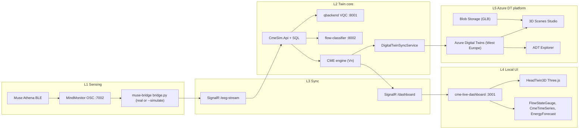

# Digital-Twin Platform — CME Cognitive Twin

Reference document for the **hybrid Digital Twin platform** behind the CME
pipeline. The local runtime (Muse Athena → bridge → CmeSim.Api SignalR →
qbackend / flow-classifier → cme-live-dashboard) is mirrored to Azure Digital
Twins through a thin summary sync. Both sides serve the same digital twin of a
user's cognitive state.

## Architecture (4 local layers + 1 cloud layer)



| Layer | Component | Repository path |
|---|---|---|
| L1 Sensing | Muse Athena + MindMonitor + bridge | [`muse-bridge/bridge.py`](../muse-bridge/bridge.py) |
| L2 Twin core | CmeSim.Api + qbackend + flow-classifier + CME engine | [`CmeSim.Api/`](../CmeSim.Api), [`qbackend/`](../qbackend), [`flow-classifier/`](../flow-classifier) |
| L2 ADT sync | `DigitalTwinSyncService` + `NoOpDigitalTwinSyncService` | [`CmeSim.Api/Services/DigitalTwinSyncService.cs`](../CmeSim.Api/Services/DigitalTwinSyncService.cs) |
| L3 Sync | SignalR hub | [`CmeSim.Api/Hubs/EegStreamHub.cs`](../CmeSim.Api/Hubs/EegStreamHub.cs) |
| L4 Local UI | React dashboard + Three.js avatar | [`cme-live-dashboard/`](../cme-live-dashboard), [`cme-live-dashboard/src/components/HeadTwin3D.tsx`](../cme-live-dashboard/src/components/HeadTwin3D.tsx) |
| L5 Cloud DT | Azure DT + Blob + 3D Scenes Studio | [`docs/azure_setup.md`](azure_setup.md), [`docs/dtdl/`](dtdl/), [`docs/scenes_studio/`](scenes_studio/) |

## Why both local Three.js and cloud 3D Scenes Studio

The two visuals are deliberately redundant:

- **Three.js `HeadTwin3D`** is the demo-safe visual. It runs offline, has no
  external dependency, and drives the live demo and video.
- **3D Scenes Studio** is the report-safe visual. It is the
  industrial-DT-platform face of the system, used to evidence the platform
  choice in §4 / §8 of the lab report. Its config and bindings are checked in
  at [`docs/scenes_studio/3DScenesConfig.json`](scenes_studio/3DScenesConfig.json).

Both consume the same `head_with_muse.glb` and the same electrode positions
(TP9/AF7/AF8/TP10), so the two views look identical and tell the same story.

## DTDL ontology

6 models + 6 relationships, all defined under [`docs/dtdl/`](dtdl/):

```
User --[wears]--> Headband
User --[runs]--> Session
User --[practiced]--> Activity        // per-user usage stats on the relationship
Headband --[hasElectrode]--> Electrode (x4 at TP9/AF7/AF8/TP10)
Session --[hasActivity]--> Activity    // current active activity (max 1)
Session --[contains]--> Window (optional, off in Phase 1 to keep cost ~0)
```

`User.json`, `Headband.json`, `Electrode.json`, `Session.json`, `Window.json`,
`Activity.json` are vendor-neutral JSON-LD; see
[`docs/dtdl/README.md`](dtdl/README.md) for the full ontology table.

## Signals carried by the twin

The mirror is intentionally a **summary** — raw 5 s windows stay in local SQL.
The twin reflects three layers of meaning:

| Layer | Twin | Property | Computed where | Why it's on the twin |
|---|---|---|---|---|
| Operations | Headband | `connectionState`, `dropoutCountLastHour`, `lastSignalQualityMean` | `DigitalTwinSyncService.PushHeadbandAsync` + `DerivedMetricsService` | Fleet ops query "which headbands are flaky right now". |
| Operations | Electrode | `contactQuality` (good/weak/none) derived from numeric `quality` | `PushElectrodesAsync` | Ditto, per channel. |
| Clinical (live) | User | `engagementIndex`, `cognitiveLoadIndex`, `relaxationIndex`, `alphaAsymmetryIndex` | `DerivedMetricsService.Compute` (in hub) | Interpreted state, not raw band powers. Same numbers feed SignalR + ADT. |
| Clinical (daily) | User | `flowMinutesToday`, `budgetUtilization`, `fatigueLevel`, `currentActivitySlug`, `currentSessionId` | `DerivedMetricsService` | "How is the user doing today" without scanning windows. |
| Session aggregates | Session | `peakPFlow`, `flowMinutes`, `dataIntegrityScore`, `bestActivity`, `endedReason` | `EegStreamHub.BuildSessionFinal` → `SessionEnded(SessionFinalDto)` | One row per session for graph queries / dashboards. |
| Activity graph | User--[practiced]-->Activity | `totalCmeVn`, `totalMinutes`, `sessionCount`, `personalAvgPFlow`, `lastUsedAt` | `DigitalTwinSyncService.BumpUserPracticedAsync` on session-end | Per-user usage stats live on the relationship so the shared Activity twin stays a catalogue entry. |

The 9 user-level derived indices are computed once in the hub and flow through
**both** SignalR (so the dashboard can render them live) and ADT (one
diff-only patch per 30 s).

## Sync behaviour (`DigitalTwinSyncService`)

The runtime contract:

- Each processed EEG window calls `RecordWindow(eeg, cme, activitySlug, complexity, mode)`,
  which fans out to `PushUserAndSessionAsync`, `PushHeadbandAsync`, `PushElectrodesAsync`.
- The service throttles per twin id to `SyncIntervalSeconds` (default 30 s).
- When `DiffOnly = true`, only properties whose value changed are patched.
- `SetActiveActivity(sessionId, slug, name)` replaces the `Session --hasActivity--> Activity`
  relationship whenever the active action changes.
- `SessionEnded(sessionId, SessionFinalDto)` patches the 5 final aggregates and
  bumps the `User --practiced--> Activity` relationship counters for each touched
  activity (1 extra write per activity per session-end).

- Telemetry (`delta`, `theta`, `alpha`, `beta`, `gamma` for electrodes;
  `currentPFlow`, `currentCmeRateVnPerSec` for the user) is published via
  `PublishTelemetryAsync`, which is what 3D Scenes Studio binds to.
- Properties (e.g. `quality`, `cumulativeCmeVn`, `inferenceMode`, the 9 new
  user-level indices, the 3 new headband health fields, `contactQuality` on
  each electrode) are patched via `UpdateDigitalTwinAsync`.
- Missing twins are auto-upserted on first patch (so a partial bootstrap is
  self-healing).
- **All Azure calls are wrapped in try/catch and logged as warnings**; failures
  never block the SignalR push or the dashboard.
- When `AzureDigitalTwins:Endpoint` is empty, `NoOpDigitalTwinSyncService` is
  registered instead, and the rest of the system is unchanged.

Configuration lives in
[`CmeSim.Api/appsettings.json`](../CmeSim.Api/appsettings.json) under the
`AzureDigitalTwins` section; secrets (`ClientSecret`) go in user-secrets / env
vars, never the repo. See
[`azure_credentials.md`](azure_credentials.md) for the explicit opt-in path
and the four secrets you need (only one is actually sensitive).

## Cost envelope — Phase 1

West Europe, pay-as-you-go, list prices 2026.

| Profile | ADT ops | Compute | Storage / misc | **Monthly** |
|---|---|---|---|---|
| Lab demo (1 user, ~30 min/week) | ~50k ops / $0.50 | local | $0.10 | **$1–3** |
| MVP, 500 users, summary-only updates, 30-s interval | ~20-40 M ops / $20–40 | App Service B2 ($55) + Container Apps ($40) + SQL S1 ($30) + Insights ($25) | $13 | **~$200** |
| MVP with naive 5-s per-window push | ~350 M ops / $3,465 | same | $13 | **~$3,600** (anti-pattern) |

The naive pattern is what the codebase **does not** do — see
`DigitalTwinSyncService` for the throttle + diff implementation.

With **Microsoft for Startups Founders Hub** credits ($1,000, no equity, no
card), the MVP profile is effectively **$0/month for ~5 months**.

## Compliance notes (Etap 9 — інформаційна безпека)

EEG data falls under GDPR Article 9 (biometric, special-category personal
data). For Phase 1:

- Storage region is fixed to **West Europe**.
- Service Principal secret is never committed; set via
  `dotnet user-secrets set "AzureDigitalTwins:ClientSecret" "<value>"`.
- Only **anonymized** twin ids are sent to Azure (`user-default`,
  `electrode-AF7`); no PII.
- JWT auth on the dashboard
  ([`LoginPage.tsx`](../cme-live-dashboard/src/pages/LoginPage.tsx)),
  HTTPS on the API.
- For full B2B / multi-tenant deployment, add a DPIA and SCC — out of scope
  for Phase 1.

## When to scale beyond Phase 1

Migrate the runtime to Azure when **any two** of the following happen:

1. First paying B2B prospect (corporate burnout monitoring) requests cloud
   hosting.
2. Sustained DAU > 1,000.
3. Multi-day analytics demand requires Azure Data Explorer integration with
   ADT's history connection.

Before then, the hybrid local-runtime + ADT-mirror is the right Pareto point.
