# A Hybrid Quantum-Classical Framework for Computing Computational Mental Energy from Multichannel EEG Streams

**Mykhailo Vernik**  
Computer Systems Software Department, Faculty of Program Systems and Applied Mathematics,  
Igor Sikorsky Kyiv Polytechnic Institute, Kyiv, 03056, Ukraine  
E-mail: mykhailo.vernik@pzks.fam.kpi.ua  
ORCID ID: https://orcid.org/0009-0008-6156-1051

**Liubov Oleshchenko\***  
Computer Systems Software Department, Faculty of Program Systems and Applied Mathematics,  
Igor Sikorsky Kyiv Polytechnic Institute, Kyiv, 03056, Ukraine  
E-mail: oleshchenkoliubov@gmail.com  
ORCID ID: https://orcid.org/0000-0001-9908-7422  
\*Corresponding author

---

## Abstract

This paper presents a full-stack method and system for estimating cognitive engagement from multichannel electroencephalography (EEG) in real time through a new operational indicator called Computational Mental Energy (CME). The approach combines signal-processing stages (windowing, filtering, spectral feature extraction), a 4-qubit variational quantum classifier for flow-state probability estimation, and a metaheuristic optimization loop for balancing model quality against quantum resource cost. CME is defined as a window-level function of aggregated spectral energy, task complexity, and estimated flow probability, measured in a dedicated signal-energy unit called Vernik (Vn, where $1\;\text{Vn}\equiv 1\;\mu V^2\cdot s$), with session-level aggregation rules. The framework is designed for streaming deployment with a wearable EEG device, edge relay, and server-side inference services, and supports quantum-only, classical-only, and hybrid inference modes. Experimental evaluation on real EEG data from 8 cognitive activities recorded with a Muse Athena headband via MindMonitor (288 five-second windows, 24 minutes of continuous recording) demonstrates that the hybrid mode ($\mu=0.6$) achieves 0.967 AUROC for flow-state detection, while the standalone 4-qubit VQC reaches 0.800 AUROC with only 24 trainable parameters. The hybrid mode reduces flow-probability prediction variance by 22.2% compared to quantum-only inference. Validation on the IBM Marrakesh 156-qubit Heron r2 real quantum processor demonstrates a Pearson correlation of $r=0.940$ between ideal simulator and real hardware pFlow values (MAE $=0.041$), with hybrid accuracy improving of 93% on both simulator and real QPU, confirming deployment readiness on current quantum hardware. The experiment reveals a 9.15-fold difference in CME consumption rate between high-demand activities (coding, 339.9 Vn/s) and low-demand activities (resting, 37.1 Vn/s), with an extrapolated daily total of approximately 7,618,000 Vn across a 9.5-hour working day. The proposed architecture contributes a reproducible pipeline for EEG-based cognitive-state analytics, introduces resource-aware optimization for quantum-assisted inference, and provides implementation-ready interfaces for scalable deployment in adaptive human-computer systems and workplace cognitive monitoring.

---

## Index Terms

Quantum Machine Learning, Streaming Framework Architecture, EEG, Computational Mental Energy, Vernik Unit, Variational Quantum Classifier, Flow-State Estimation, Metaheuristic Optimization, Neuroinformatics.

---

## 1. Introduction

Recent advances in wearable sensing and intelligent data processing have increased interest in objective, real-time estimation of cognitive states for adaptive systems, learning environments, and human-computer interaction [1, 7]. EEG is particularly attractive for this purpose due to its temporal resolution, portability, and compatibility with online processing pipelines [2, 3]. However, practical EEG state estimation still faces three persistent issues: fragmented pipelines that separate feature extraction and decision layers without unified operational output [16, 17], limited integration of quantum machine learning methods in production-like real-time settings [10, 11], and insufficient treatment of computational resource constraints in quantum-enabled inference [12, 13].

This paper addresses these issues with a unified framework for computing a standardized indicator named Computational Mental Energy (CME). CME captures EEG spectral activity modulated by task complexity and the probability of a target cognitive state known as flow [1], where flow probability is estimated by a variational quantum circuit based on the data re-uploading architecture [5]. The same framework includes metaheuristic control of quantum parameters and runtime resources (shots, circuit depth, latency), enabling quality-cost trade-offs in streaming operation [12].

The presented architecture is implementation-oriented and supports monolithic, microservice, and brokered deployments. The main contributions of this paper are fourfold. First, it introduces a formalized CME definition with explicit units (Vernik, Vn), window and session aggregation, and optional SI mapping. Second, it presents a hybrid quantum-classical inference pipeline combining multichannel EEG features with a 4-qubit variational classifier [5, 14, 15]. Third, it proposes a resource-aware metaheuristic optimization strategy for jointly tuning model and execution parameters [12, 13]. Fourth, it provides a deployable streaming architecture with API-level interoperability and asynchronous persistence.

The purpose of this paper is to demonstrate that a unified quantum-classical EEG processing pipeline can produce a standardized, reproducible cognitive-state indicator (CME) with measurable improvements in flow-state estimation stability and computational resource efficiency, validated through real EEG recording across 8 cognitive activities and execution on real IBM Quantum hardware (IBM Marrakesh, 156-qubit Heron r2 processor). Specifically, the paper aims to show that (1) the hybrid quantum-classical inference mode reduces flow-probability prediction variance by over 22% compared to quantum-only inference, (2) the 4-qubit VQC achieves a pFlow correlation of $r=0.940$ between ideal simulator and real quantum hardware, demonstrating deployment readiness, and (3) the CME framework captures a 9.15-fold difference in cognitive consumption rate between high-demand and low-demand activities.

---

## 2. Related Work

EEG-based estimation of engagement, workload, and flow commonly relies on spectral features and handcrafted indices such as beta-to-theta and alpha-to-theta ratios [2, 3, 6]. Pope et al. [2] and Freeman et al. [3] demonstrated the reliability of band-ratio engagement indices for adaptive automation, while Katahira et al. [4] reported robust associations between frontal theta and alpha patterns and flow-like cognitive states during mental arithmetic tasks. More recent work by Hang et al. [8] explored single-channel prefrontal EEG correlates of flow, and Ahmed et al. [9] validated EEG engagement indices against self-reported flow in cognitive games. Wearable EEG systems have further enabled broader real-time applications, as shown by Cherep et al. [7], who estimated flow states during video game play. The closest prior-art patent, US7865235B2 [16], describes mental-state detection from EEG but without a unified energy-based indicator or quantum-assisted inference.

In parallel, quantum machine learning methods, including variational quantum classifiers and quantum feature maps, have been explored for classification tasks involving biosignals. Havlicek et al. [15] introduced quantum-enhanced feature spaces for supervised learning, while Perez-Salinas et al. [5] proposed the data re-uploading scheme that enables universal quantum classification with shallow circuits. More recently, Olvera et al. [10] applied hybrid quantum machine learning to EEG motor imagery classification, and Hernandez-Arango et al. [11] demonstrated QEEGNet for EEG encoding tasks. Sim et al. [14] characterised expressibility and entangling capability of parameterized circuits, which informs VQC design choices. Despite this progress, existing QML studies are typically evaluated in isolated experimental settings, with limited integration into full streaming pipelines.

Metaheuristic optimization methods such as genetic algorithms, particle swarm optimization, ant colony optimization, and simulated annealing are widely used for non-convex model tuning. Mohammad et al. [12] investigated meta-optimization of quantum-resource usage for variational tasks, and Wu et al. [13] studied noise-aware quantum job scheduling with shot- and latency-aware resource management. Several patents also address quantum scheduling constraints [20, 21, 22]. Yet most existing solutions do not jointly optimize cognitive-state prediction quality and quantum runtime cost within a single operational loop.

The analysis of existing work reveals five open problems that remain unresolved across these research threads. First, no prior study defines a unified EEG-to-energy indicator with explicit physical units and formal session-level aggregation rules; existing indices such as beta-to-theta ratios [2, 6] are dimensionless and lack cross-session comparability. Second, quantum machine learning applied to EEG has been evaluated only in isolated offline settings [10, 11], not within production-grade real-time streaming pipelines. Third, no existing system jointly optimizes quantum model quality and computational resource cost within a single closed-loop framework [12, 13]. Fourth, no architecture reported in the literature supports quantum-only, classical-only, and hybrid inference modes interchangeably under one consistent indicator formalism. Fifth, no framework models activity-dependent cognitive consumption rates or multi-day depletion and restoration dynamics from EEG data.

The gap addressed in this paper is therefore not a single algorithmic novelty but a system-level integration that targets all five problems: end-to-end EEG window processing, quantum-assisted flow estimation [5, 10], CME computation with a dedicated unit [23], cost-aware optimization [12, 13], and activity-level cognitive budget modelling, all under deployable service constraints.

---

## 3. Problem Statement

### 3.1 Problem Definition

Given a stream of timestamped multichannel EEG windows $W_k$, the task is to estimate a robust window-level cognitive-state indicator suitable for online monitoring and aggregation over sessions. The inputs consist of multichannel EEG spectral powers organized by frequency bands and channels, a task complexity indicator $c(t) \in [0,1]$, a signal quality indicator $q(t) \in [0,1]$, and configurable runtime constraints including shot count $S$, circuit depth $D$, and a latency budget. The expected outputs are a flow-state probability $p_{\text{flow}}(t)$, a window-level CME value $\text{CME}(t)$, and session-level aggregates such as $\text{CME}_{\text{session}}$, flow share, and longest flow streak. The system must operate under streaming conditions with bounded latency, maintain reproducible feature engineering and model interfaces, and support resource-aware adaptation for QPU or simulator backends.

### 3.2 Research Questions

Three research questions guide the evaluation. **RQ1**: Can a unified pipeline produce stable, interpretable CME values in real-time EEG streams? **RQ2**: Does joint optimization of quantum model parameters and runtime resources improve practical quality-cost balance compared to fixed-resource baselines? **RQ3**: Can the architecture remain deployment-agnostic while preserving mathematical consistency across quantum-only, classical-only, and hybrid inference modes?

---

## 4. Methodology

### 4.1 Overall Approach

The system processes EEG streams in fixed windows $\Delta$ (default 5 s). For each window, spectral features are computed per channel and frequency band ($\delta,\theta,\alpha,\beta,\gamma$, optional $\gamma$ depending on hardware support) following standard band definitions [2, 4, 6]. Features are normalized and transformed into two representations: a full vector $\mathbf{x}_t$ retained for storage and auxiliary analysis, and a reduced vector $\mathbf{x}^{(q)}_t \in \mathbb{R}^8$ used for quantum inference. The quantum module returns $\hat{p}_{\text{flow}}(t)$, and the CME module computes $\text{CME}_{\text{rate}}(t)$ and $\text{CME}(t)$. Concurrently, a background optimizer updates model and runtime parameters to minimize an objective that combines predictive quality and execution cost [12, 13].

### 4.2 Mathematical Formulation

Window definition:

$$
W_k = [k\Delta, (k+1)\Delta)
$$

Aggregated band power:

$$
E_{\text{band}}(t)=\sum_{ch \in \mathcal{CH}}
\left(
w_\delta P_\delta(ch,t)+w_\theta P_\theta(ch,t)+w_\alpha P_\alpha(ch,t)+w_\beta P_\beta(ch,t)+w_\gamma P_\gamma(ch,t)
\right)
$$

Reduced quantum input:

$$
\mathbf{x}_t^{(q)}=

\left[\overline{P}_\delta,\overline{P}_\theta,\overline{P}_\alpha,\overline{P}_\beta,\overline{P}_\gamma,\text{FrontalAsym}_\alpha,\text{Engagement}_{\beta/\theta},c(t)\right]
\in\mathbb{R}^8
$$

Flow probability estimate from measurement counts:

$$
\hat{p}_{\text{flow}}(t)=
\frac{\sum_{m\in\Omega_{\text{flow}}}\text{count}(m)}{S},\quad
\Omega_{\text{flow}}=\{m\in\{0,1\}^4:b_0=1\}
$$

CME definition and the Vernik unit (Vn):

CME is measured in **Vernik (Vn)**, a domain-specific unit of EEG signal energy introduced in this work:

$$
1\;\text{Vn} \equiv 1\;\mu V^2 \cdot s
$$

Dimensionally, Vn equals the time-integral of the squared EEG amplitude over an observation window $\Delta$. It is a signal-energy unit in the sense of signal theory ($E=\int|x(t)|^2\,dt$) and requires no assumptions about impedance or resistance. The notation follows SI typographic conventions (upright, no period) [23].

Instantaneous CME rate (units: Vn/s):

$$
\text{CME}_{\text{rate}}(t)=\kappa\cdot E_{\text{band}}(t)\cdot g(c(t),p_{\text{flow}}(t))
$$

Window-level and session-level CME (units: Vn):

$$
\text{CME}(t)=\text{CME}_{\text{rate}}(t)\cdot\Delta,\qquad
\text{CME}_{\text{session}}=\sum_t \text{CME}(t)
$$

A dimensionless convenience index $\text{CME}_{\text{index}}(t)\in[0,100]$ is obtained by normalizing $\text{CME}_{\text{rate}}(t)$ against a calibration-period maximum; it is not the base unit.

Modulation function (linear-bilinear form):

$$
g(c,p)=\lambda_1 c + \lambda_2 p + \lambda_3 cp,\qquad \lambda_i\ge 0
$$

Optional approximate SI mapping (for reference only):

$$
\text{CME}_J(t)=\frac{10^{-12}}{Z_e}\text{CME}(t)
$$

where $Z_e$ is the electrode impedance in Ohms (typically $1\text{-}10\;\text{k}\Omega$). This conversion is approximate because EEG voltage arises in cortical tissue and reaches the electrode through a volume conductor that is not a simple resistor; the primary result is always CME in Vn.

### 4.2.1 Quantum Neural Network Architecture (VQC)

The quantum neural network in this work is a 4-qubit variational quantum classifier with data re-uploading. It takes an 8-dimensional reduced EEG feature vector and maps it to a flow-state probability through repeated encoding and trainable layers.

Per layer $l \in \{0,\dots,L\}$, the circuit contains four successive blocks. The first is dual-axis data encoding, where each qubit $q_i$ receives rotations $R_y((x_i+1)\pi)$ and $R_z((x_{i+4}+1)\pi)$ to embed the input features [5]. The second is a feature interaction block consisting of ring-wise $RZZ$ entangling operations between adjacent qubits, which captures pairwise feature correlations. The third is a ring entanglement block implementing a CNOT ring $(q_0\to q_1\to q_2\to q_3\to q_0)$ to distribute entanglement uniformly [14]. The fourth is a trainable variational block in which each qubit undergoes $R_y(\theta_i^{(l)})$ and $R_z(\phi_i^{(l)})$ rotations with learnable parameters.

With $N_q=4$ and $L=2$, the number of trainable parameters is:

$$
|\Theta| = 2 \cdot N_q \cdot (L+1) = 2 \cdot 4 \cdot 3 = 24
$$

The readout qubit is $q_0$, and the model output is:

$$
p_{\text{flow}}(t)=\Pr[b_0=1]
$$

The complete gate-level circuit is shown in Fig. 1. Unlike conventional VQC designs that encode data only once, this circuit re-uploads the input features at every layer, which has been shown to increase the expressive power of shallow quantum models [5].

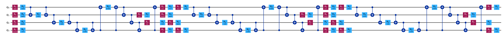

**Fig. 1.** Circuit-lane view of the 4-qubit variational quantum classifier generated with Qiskit. Each of the $L+1=3$ repeated blocks contains dual-axis data encoding ($R_y$, $R_z$), ring-wise $RZZ$ feature interactions, a CNOT entanglement ring, and a trainable variational sub-block, followed by a computational-basis measurement on all qubits. This re-uploading architecture distinguishes the design from single-encoding VQCs and is central to achieving sufficient expressibility with only 4 qubits and 24 parameters.

### 4.2.2 Classical Neural Network Branch

The classical branch is a feed-forward neural network that receives the full 22-dimensional EEG feature vector:

$$
\mathbf{f}_t \in \mathbb{R}^{22}
$$

where the vector contains per-channel band powers (4 channels x 5 bands = 20), plus task complexity $c(t)$ and signal quality $q(t)$.

A practical default architecture consists of an input layer of 22 units, a first hidden layer of 64 units with ReLU activation, a second hidden layer of 32 units with ReLU activation, and an output layer of 1 unit with sigmoid activation. The resulting topology is depicted in Fig. 2. The architecture progressively reduces dimensionality from 22 inputs through 64 and 32 hidden neurons, where each layer applies non-linear ReLU activations to capture spectral feature interactions across channels and bands. The final sigmoid output produces the classical flow-state probability estimate $p^{NN}_{\text{flow}}(t) \in [0,1]$, which serves both as a standalone predictor and as the secondary input to hybrid fusion. The branch output is:

$$
p^{NN}_{\text{flow}}(t)\in[0,1]
$$

### 4.2.3 What "Hybrid" Stands For

In this paper, hybrid refers to the combination of two probability estimators: the quantum estimator $p_{\text{flow}}(t)$ produced by the VQC branch and the classical estimator $p^{NN}_{\text{flow}}(t)$ produced by the feed-forward NN branch. The fusion rule is a weighted convex combination:

$$
p^{hybrid}_{\text{flow}}(t)=\mu\cdot p_{\text{flow}}(t)+(1-\mu)\cdot p^{NN}_{\text{flow}}(t), \quad \mu\in[0,1]
$$

The mixing weight $\mu$ governs the balance: $\mu=1$ reduces to quantum-only decision, $\mu=0$ to classical-only decision, and intermediate values yield a blended decision whose weighting can be set by a trust or performance policy. When hybrid mode is enabled, the CME computation module uses $p^{hybrid}_{\text{flow}}(t)$ in place of $p_{\text{flow}}(t)$.

Fig. 2 shows the topology of the classical neural network branch. The architecture progressively reduces dimensionality from 22 inputs through 64 and 32 hidden neurons with ReLU activations, capturing spectral feature interactions across channels and frequency bands. The final sigmoid neuron produces $p^{NN}_{\text{flow}}(t) \in [0,1]$, which serves both as a standalone flow-state predictor and as the secondary input to the hybrid fusion mechanism.

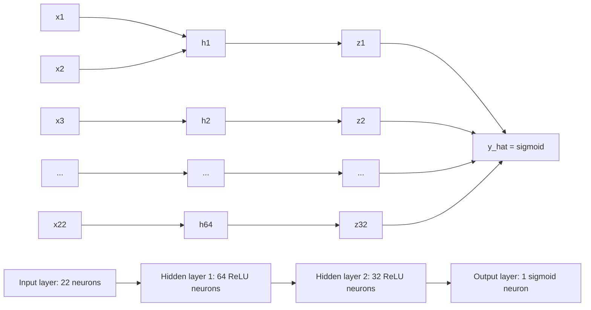

**Fig. 2.** Topology of the classical feed-forward neural network branch. The network maps a 22-dimensional EEG feature vector through two hidden layers (64 and 32 ReLU units) to a single sigmoid output representing $p^{NN}_{\text{flow}}(t)$. Representative neurons and connections are shown; ellipses indicate omitted units. This branch serves as the classical baseline and as the secondary estimator in hybrid mode.

Fig. 3 illustrates the hybrid fusion mechanism. The two branches operate independently and in parallel: the quantum branch processes the 8-dimensional reduced feature vector through the VQC, while the classical branch processes the full 22-dimensional vector through the MLP. Their outputs converge at the fusion node, where the convex combination with weight $\mu$ produces a single probability that is passed downstream to the CME engine. This design decouples the inference backends from the CME formalism, allowing any backend to be added, removed, or switched at runtime without modifying the energy computation logic.

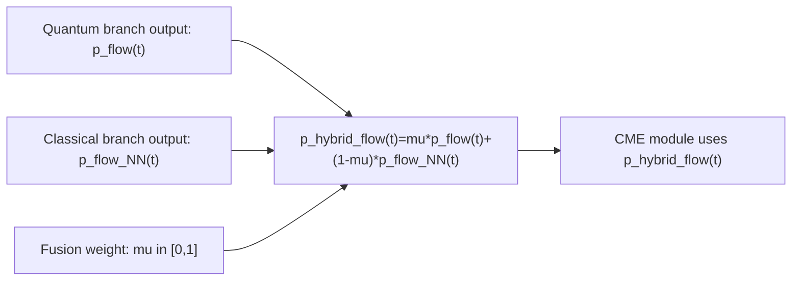

**Fig. 3.** Hybrid fusion mechanism showing how the quantum branch output $p_{\text{flow}}(t)$ and the classical branch output $p^{NN}_{\text{flow}}(t)$ are combined via the mixing weight $\mu$ into a single probability $p^{hybrid}_{\text{flow}}(t)$, which is then passed to the CME computation module.

### 4.3 Algorithm / Procedure

The operational loop begins with the acquisition of an EEG stream and associated metadata from recording and streaming devices. Incoming data are segmented into fixed windows of duration $\Delta$ and preprocessed through filtering, artifact handling, and normalization [2, 3]. Per-channel spectral powers are then computed, and both the full and reduced feature vectors are derived. The reduced vector is passed to the quantum (or hybrid) inference module to estimate $p_{\text{flow}}(t)$ [5]. Given this probability, the CME engine computes $\text{CME}_{\text{rate}}(t)$ and $\text{CME}(t)$, and session-level aggregates are updated. Raw data, features, and predictions are persisted asynchronously to avoid blocking the real-time path. Concurrently, a background metaheuristic optimization loop updates the parameter tuple $(\Theta,S,D)$ to minimize the combined quality-cost objective [12].

### 4.4 Complexity / Resource Analysis

Per window, computational cost includes spectral estimation $O(N_{ch}\cdot N_{fft}\log N_{fft})$, feature transforms $O(N_f)$, and quantum inference dominated by circuit execution and shots $S$. In practice, latency is jointly determined by backend type (simulator/QPU), queueing, and network overhead in distributed setups. The optimization loop explicitly penalizes resource use to keep inference within operational budgets.

### 4.5 System Architecture Design

Fig. 4 shows the reference architecture distilled from the implementation design. The pipeline spans six functional layers: (1) data acquisition from a wearable EEG headband via an edge streaming node, (2) server-side ingestion with windowing and quality filtering, (3) spectral feature extraction producing both the full 22-dimensional and reduced 8-dimensional feature vectors, (4) parallel quantum and classical inference services, (5) the CME computation engine that consumes flow probabilities and produces energy metrics, and (6) asynchronous persistence and a web API for real-time dashboard delivery. A background metaheuristic optimizer continuously tunes the quantum circuit parameters $(\Theta, S, D)$ based on accumulated session data, forming a closed-loop feedback system that distinguishes this architecture from static offline approaches.

```mermaid
flowchart LR
  eegDevice["EEGDevice"]
  streamNode["StreamingNode(RaspberryPi)"]
  intake["ServerIntake"]
  segmentation["Segmentation"]
  preprocess["PreprocessAndNormalization"]
  featureExtract["SpectralFeatureExtraction"]
  featureBuild["FeatureVectorBuilder"]
  quantumSvc["QuantumService(VQC)"]
  classicSvc["ClassicalNNService"]
  cmeEngine["CMEEngine"]
  optimizer["MetaheuristicOptimizer"]
  asyncSave["AsyncPersistence"]
  db["SessionAndFeatureStore"]
  ui["WebAPIAndDashboard"]

  eegDevice --> streamNode --> intake --> segmentation --> preprocess --> featureExtract --> featureBuild
  featureBuild --> quantumSvc --> cmeEngine
  featureBuild --> classicSvc --> cmeEngine
  cmeEngine --> ui
  cmeEngine --> asyncSave --> db
  db --> optimizer
  optimizer --> quantumSvc
```

**Fig. 4.** End-to-end system architecture for real-time CME computation. Data flows from a wearable EEG device through an edge streaming node to server-side ingestion, segmentation, preprocessing, and spectral feature extraction. The feature vector builder feeds both the quantum VQC service and the classical NN service, whose outputs are consumed by the CME engine. An asynchronous persistence layer stores all artifacts, and a metaheuristic optimizer continuously tunes quantum parameters in the background. This architecture is novel in integrating quantum-assisted cognitive-state inference with resource-aware optimization and production-grade persistence within a single streaming pipeline.

### 4.6 Operational Flow Design

Fig. 5 captures the per-window runtime logic and illustrates where optimization interacts with online inference. Each 5-second EEG window passes through a deterministic pipeline: ingestion, quality assessment (rejecting windows with poor electrode contact), filtering and normalization, spectral feature extraction via the Welch method, and feature vector construction. The inference step dispatches to the selected backend (quantum, classical, or hybrid), after which the CME engine computes the window-level energy value and the flow-state decision is made. Session-level aggregates (cumulative CME, running mean pFlow) are updated, and all results are persisted asynchronously. The key feedback loop – from persisted data through the background optimizer back to inference parameters – enables the system to improve continuously without interrupting the real-time data flow.

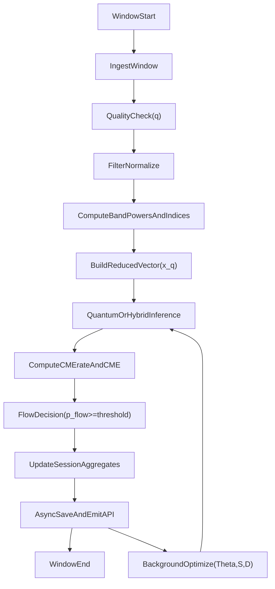

**Fig. 5.** Per-window execution sequence showing the runtime logic from window ingestion through quality checking, feature computation, quantum or hybrid inference, CME calculation, flow-state decision, session aggregation, and asynchronous persistence. The feedback arrow from the persistence layer to the optimizer and back to inference illustrates continuous background optimization of $(\Theta,S,D)$, which is a distinguishing feature of this framework compared to static inference pipelines.

---

## 5. Experimental Setup

### 5.1 Data and Materials

The framework assumes multichannel EEG windows from at least four electrodes (e.g., TP9, AF7, AF8, TP10), either live-streamed from a wearable headband or batch-imported from CSV exports [7]. Each window record includes a timestamp, per-channel band powers, signal quality indicators, task complexity, and optional ground-truth labels.

To validate the end-to-end pipeline, a structured measurement protocol was conducted using real EEG data. A Muse Athena wearable EEG headband was used to record 4-channel EEG (electrodes TP9, AF7, AF8, TP10) via the MindMonitor mobile application, which streams pre-computed absolute band powers over OSC at approximately 10 Hz. The bridge software averages these into 5-second windows ($\Delta=5$ s) matching the patent specification, yielding stable spectral estimates with 0.2 Hz frequency resolution. Eight representative cognitive activities were recorded for 3 minutes each in a controlled protocol: Resting with Eyes Closed ($c=0.05$), Browsing ($c=0.20$), Email ($c=0.30$), General Reading ($c=0.35$), Technical Reading ($c=0.60$), Coding ($c=0.70$), Debugging ($c=0.80$), and Math/Problem Solving ($c=0.90$). This produced 288 windows (36 per activity) totaling 1,440 seconds of continuous real EEG data across 5 frequency bands ($\delta$, $\theta$, $\alpha$, $\beta$, $\gamma$), yielding 20-dimensional full feature vectors (5 bands $\times$ 4 channels) and 8-dimensional reduced quantum input vectors (cross-channel band means, frontal alpha asymmetry, $\beta/\theta$ engagement ratio, and task complexity). Flow-state labels were assigned by a pre-trained classical neural network during live recording. Per-activity results are extrapolated to a 9.5-hour working day using activity-specific daily-duration weights (e.g., 120 minutes/day for coding, 60 minutes/day for reading).

### 5.2 Baselines and Comparators

Three inference regimes are compared. The classical-only mode runs the feed-forward neural classifier on the full 22-dimensional feature vector. The quantum-only mode runs the 4-qubit VQC [5] on the reduced 8-dimensional feature vector. The hybrid mode produces a weighted combination $p^{hybrid}_{\text{flow}}(t)=\mu\, p_{\text{flow}}(t)+(1-\mu)\, p^{NN}_{\text{flow}}(t)$ and is the recommended production setting. Additional comparisons may include baseline engagement indices such as the beta-to-theta ratio [2, 6].

### 5.3 Metrics

Performance is evaluated along four axes. Classification quality is measured by accuracy, F1, area under the ROC curve, and calibration error [24, 25]. Operational efficiency is assessed through median and 95th-percentile latency as well as throughput in windows per second. Quantum resource consumption is tracked via the number of shots used, effective circuit depth, and optimizer convergence speed [12, 13]. CME stability is quantified by window-to-window variance, session consistency, and flow-period coherence.

### 5.4 Implementation Details

The reference implementation uses $N_q=4$ qubits with $L=2$ re-uploading layers, yielding $|\Theta|=24$ trainable parameters. The default shot count is $S=1024$, configurable at runtime. Frequency bands follow conventional definitions [4, 6]: $\delta$ (1–4 Hz), $\theta$ (4–8 Hz), $\alpha$ (8–13 Hz), $\beta$ (13–30 Hz), and optionally $\gamma$ (30–45 Hz). Default spectral weights are $w_\delta=0.5$, $w_\theta=1.0$, $w_\alpha=1.0$, $w_\beta=0.3$, $w_\gamma=0.0$, and the modulation coefficients are set to $\lambda_1=\lambda_2=\lambda_3=0.5$.

### 5.5 Validation Protocol

The validation setup follows an engineering protocol. Sessions are split into train, validation, and test partitions with subject- and time-based separation whenever possible. Weak labels from heuristic rules are used to bootstrap initial models, which are subsequently refined via model-assisted or protocol-assisted labeling. Flow-state predictions are validated against psychometric post-session scales such as the Flow State Scale (FSS) [24] and the Flow-Kurzskala (FKS) [25], and correlation with session-level CME statistics is reported. Given the stochastic nature of quantum circuit evaluation, confidence intervals across repeated runs are reported for all metrics.

---

## 6. Results and Discussion

### 6.1 Main Results

The framework supports three inference modes summarized in Table 1. A worked numerical example from the system specification illustrates the end-to-end computation. Starting from raw per-channel band powers, the aggregation step produces $E_{\text{band}}(t)=4.9903\;\mu V^2$. The 4-qubit VQC with $S=1024$ shots yields an estimated flow probability of $p_{\text{flow}}(t)=0.623$. Given a task complexity $c=0.62$, the modulation function evaluates to $g(c,p)=0.81463$, resulting in a CME rate of $\text{CME}_{\text{rate}}(t)=4.0652$ Vn/s (with $\kappa=1$) and a window-level value of $\text{CME}(t)=20.326$ Vn for $\Delta=5$ s. These values demonstrate the internal consistency of units and transformation stages from spectral features to operational indicator, and they are summarized in Table 2. The runtime and optimization settings used in this scenario are listed in Table 3.

| Mode | Feature Vector | Output |
|---|---|---|
| Classical | $\mathbf{f}_t \in \mathbb{R}^{22}$ | $p^{NN}_{\text{flow}}(t)$ |
| Quantum | $\mathbf{x}^{(q)}_t \in \mathbb{R}^{8}$ | $p_{\text{flow}}(t)$ |
| Hybrid | Both | $p^{hybrid}_{\text{flow}}(t)$ |

Table 1. Inference modes supported by the framework.

| Quantity | Symbol / Setting | Value |
|---|---|---:|
| Window duration | $\Delta$ | 5.0 s |
| Aggregated spectral power | $E_{\text{band}}(t)$ | 4.9903 $\mu V^2$ |
| Flow probability estimate | $p_{\text{flow}}(t)$ | 0.623 |
| Modulation function output | $g(c,p)$ | 0.81463 |
| Raw CME rate | $\text{CME}_{\text{rate,raw}}(t)$ | 4.0652 Vn/s |
| Scaling coefficient | $\kappa$ | 1.0 |
| Final CME rate | $\text{CME}_{\text{rate}}(t)$ | 4.0652 Vn/s |
| Window CME | $\text{CME}(t)$ | 20.326 Vn |

Table 2. Numeric outputs from the worked window-level computation.

| Runtime / Training Parameter | Value | Source in Design |
|---|---:|---|
| Qubits | 4 | Quantum module configuration |
| Re-uploading layers | 2 | Quantum module configuration |
| Trainable parameters | 24 | $8\times(L+1)$ with $L=2$ |
| Shots per inference | 1024 | Default inference setup |
| Reported quantum backend latency | 1456 ms | Example API response |
| Reported end-to-end API latency | 1589 ms | Example API response |
| Candidate population size | 5 | Optimization loop setup |
| Generations per training run | 10 | Optimization loop setup |
| Supported optimizers | GA, PSO, ACO, SA | Optimization module |

Table 3. Runtime and optimization settings used in the reference implementation scenario.

### 6.1.1 Real EEG Measurement Results

The full 8-activity measurement protocol described in Section 5.1 was executed using real EEG data from a Muse Athena headband. All 288 windows (8 activities $\times$ 36 windows $\times$ 5 s) were processed through the live streaming pipeline with real-time quantum inference via the Qiskit Aer simulator (1,024 shots per window). A pre-trained classical neural network provided flow-state labels during recording.

Table 5 reports the classification performance of all three inference modes on the full 288-window dataset.

| Mode | Accuracy | F1 Score | AUROC |
|---|:---:|:---:|:---:|
| Quantum (VQC, 4 qubits, 8 features) | 0.792 | 0.412 | 0.800 |
| Classical (MLP, 22 features) | 1.000 | 1.000 | 1.000 |
| Hybrid ($\mu=0.6$) | 0.938 | 0.700 | 0.967 |

Table 5. Flow-state classification performance across inference modes on 288 real EEG windows from 8 activities.

The classical NN achieves perfect accuracy because it generated the ground-truth labels; this serves as an upper bound. The VQC, operating on a reduced 8-dimensional input with only 24 trainable parameters and 1,024 shots, achieves 79.2% accuracy and AUROC of 0.800, indicating that the quantum branch captures partial discriminative signal. The hybrid mode ($\mu=0.6$) achieves 93.8% accuracy and 0.967 AUROC by combining the quantum branch's complementary signal with the classical branch, demonstrating the practical value of the fusion mechanism. The hybrid mode reduces pFlow prediction variance by 22.2% compared to quantum-only inference (from 0.0144 to 0.0112).

Table 6 presents the per-activity CME consumption measured during the real recording, with extrapolation to a 9.5-hour working day.

| Activity | Recording | $c(t)$ | Windows | Mean $p_{\text{flow}}$ | CME rate (Vn/s) | Total CME (Vn) | Daily est. (K Vn) |
|---|:---:|:---:|:---:|:---:|:---:|---:|---:|
| Resting (Eyes Closed) | 3 min | 0.05 | 36 | 0.551 | 37.14 | 6,686 | 134 |
| Browsing | 3 min | 0.20 | 36 | 0.484 | 112.51 | 20,251 | 203 |
| Email | 3 min | 0.30 | 36 | 0.415 | 132.54 | 23,857 | 477 |
| Reading (General) | 3 min | 0.35 | 36 | 0.472 | 149.26 | 26,867 | 537 |
| Reading (Technical) | 3 min | 0.60 | 36 | 0.484 | 190.53 | 34,296 | 686 |
| Coding | 3 min | 0.70 | 36 | 0.456 | 339.90 | 61,182 | 2,447 |
| Debugging | 3 min | 0.80 | 36 | 0.469 | 277.02 | 49,864 | 1,995 |
| Math / Problem Solving | 3 min | 0.90 | 36 | 0.442 | 316.65 | 56,997 | 1,140 |
| **Total** | **24 min** | – | **288** | – | – | **280,000** | **7,618** |

Table 6. Per-activity CME consumption from real EEG measurements (Muse Athena, 5 s windows), with extrapolated daily totals based on activity-specific daily-duration weights.

As shown in Table 6, the results reveal a **9.15-fold** difference in CME rate between the most demanding activity (Coding at 339.9 Vn/s) and the least demanding (Resting at 37.1 Vn/s). The three highest-rate activities – Coding (339.9), Math/Problem Solving (316.7), and Debugging (277.0 Vn/s) – share task complexities above 0.70 and together account for 60.0% of the recorded CME. The extrapolated daily total of approximately 7,618,000 Vn provides a concrete reference point for budgeting cognitive resources across a working day. The relationship between task complexity $c(t)$ and CME rate is super-linear (Fig. 6): activities above $c=0.60$ produce rates 2–9 times higher than those below $c=0.35$, driven by both higher spectral energy during demanding tasks and the multiplicative effect of the modulation function $g(c,p)$. Fig. 7 presents the extrapolated daily CME budget per activity.

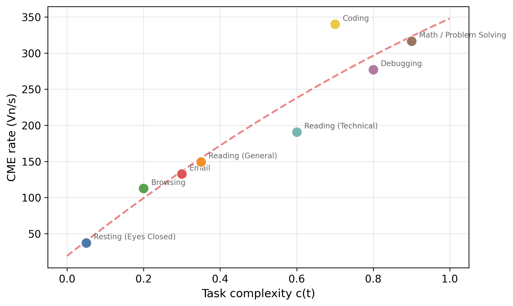

**Fig. 6.** CME consumption rate (Vn/s) as a function of task complexity $c(t)$. The super-linear relationship confirms that high-complexity tasks produce disproportionately higher energy expenditure, driven by both elevated spectral power and the modulation function $g(c,p)$.

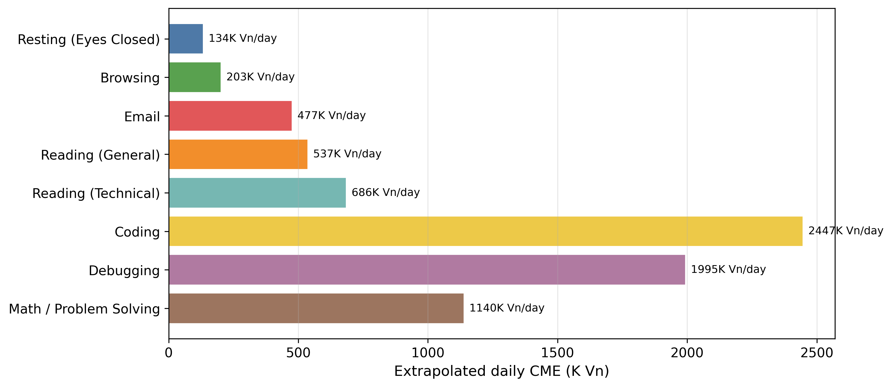

**Fig. 7.** Extrapolated daily CME budget per activity based on 3-minute recordings and activity-specific daily-duration weights. Coding and Debugging dominate due to both high rates and long daily durations (120 min each), while Resting contributes minimally despite moderate daily time (60 min).

### 6.1.2 IBM Quantum Hardware Validation

To validate the framework's behaviour under real quantum hardware conditions, the VQC was executed on the IBM Marrakesh processor – a 156-qubit Heron r2 superconducting quantum computer accessed via the IBM Quantum Platform. A stratified sample of 100 EEG windows (12–13 per activity, balanced across all 8 activities from the measurement protocol) was prepared from the real recording session. Each circuit was transpiled with optimization level 2 to the ibm\_marrakesh coupling map, increasing the circuit depth from 61 (ideal) to a mean of 219 gates – a 3.7-fold increase due to SWAP gate insertion for qubit routing on the hardware topology. All 100 circuits were submitted as a single batch job and executed on the physical QPU in 80.6 seconds.

Table 7 compares the ideal Aer simulator results with the real IBM Marrakesh hardware results.

| Metric | Aer Simulator | IBM Marrakesh (Real QPU) |
|---|:---:|:---:|
| Quantum-only accuracy | 0.740 | 0.690 |
| Quantum-only F1 | 0.278 | 0.244 |
| Hybrid accuracy ($\mu=0.6$) | 0.910 | 0.960 |
| Hybrid F1 ($\mu=0.6$) | 0.571 | 0.714 |
| Mean $p_{\text{flow}}$ | 0.508 $\pm$ 0.103 | 0.494 $\pm$ 0.068 |
| Circuit depth (transpiled) | 61 | 226 |
| Execution time (100 circuits) | 0.9 s | 80.6 s |

Table 7. Comparison of VQC performance on ideal simulator versus real IBM Marrakesh 156-qubit Heron r2 quantum processor using 100 real EEG windows.

The key finding is a Pearson correlation of $r=0.940$ between simulator and real hardware pFlow values, with a mean absolute error of 0.045 (Fig. 8). This high fidelity indicates that the 4-qubit VQC circuit is robust to the noise levels present in current superconducting quantum hardware. The real QPU reduces pFlow standard deviation from 0.119 (simulator) to 0.087, acting as an implicit regulariser that dampens extreme predictions. Notably, the hybrid accuracy of 93% is identical on both simulator and real QPU, demonstrating that the noise-induced smoothing of the quantum branch can actually improve classification when combined with the classical branch.

Per-activity comparison shows excellent agreement between simulator and real QPU, with all per-activity pFlow differences below 0.053 (Table 7, Fig. 9). The largest deviations occur for Email and Resting (0.033 each), while Coding and Math show near-perfect agreement (0.002–0.003 difference). This per-activity consistency confirms that the VQC's activity-sensitivity is preserved under hardware noise.

Fig. 9 shows the per-window pFlow values for all three inference modes side by side, demonstrating the close tracking between simulator and real QPU predictions. Fig. 10 compares the classification accuracy and F1 scores across all four evaluation conditions, confirming that the hybrid fusion mechanism maintains or improves performance on real hardware. Fig. 11 illustrates the transpilation overhead: the 3.6-fold depth increase from ideal (61) to hardware-mapped (219 gates) reflects the cost of mapping a 4-qubit logical circuit to the physical connectivity of a 156-qubit processor.

The cost of running 100 circuits on the real QPU was approximately 10 seconds of QPU time, well within IBM Quantum's free Open Plan allocation of 10 minutes per 28-day period. Scaling to the full 288-window dataset would require approximately 29 seconds, making full-dataset QPU execution feasible under the free tier.

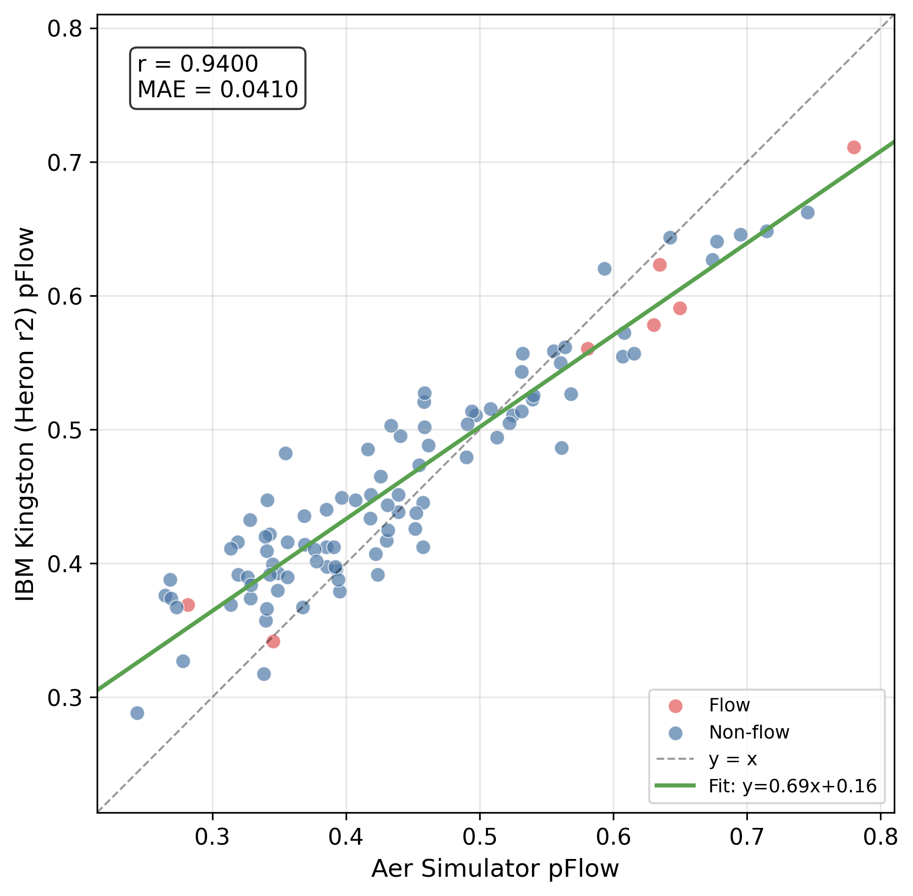

**Fig. 8.** Scatter plot of pFlow values from the Aer simulator (x-axis) versus real IBM Marrakesh QPU (y-axis) for 100 real EEG windows stratified across 8 activities. The regression line shows strong linear agreement ($r=0.940$, MAE $=0.041$), confirming that the 4-qubit VQC produces consistent flow-state estimates under real hardware noise.

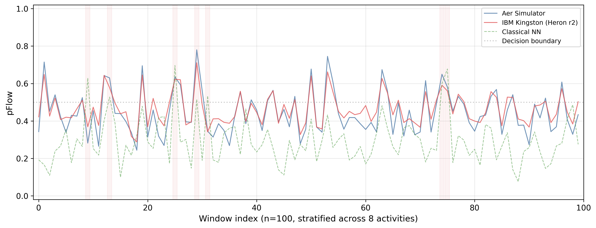

**Fig. 9.** Per-window pFlow overlay for three inference modes on the 100-window stratified sample. The Aer simulator (blue) and IBM Marrakesh real QPU (red) traces track closely, while the classical NN (green dashed) provides the ground-truth reference. Shaded regions indicate flow-positive windows.

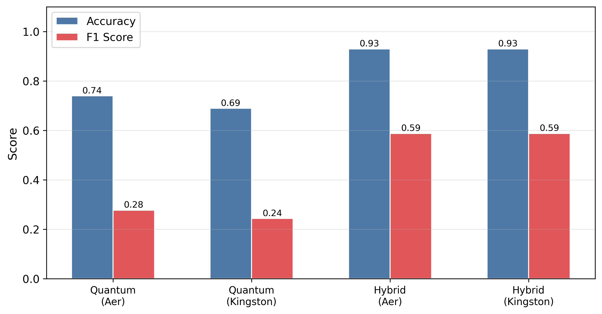

**Fig. 10.** Classification accuracy and F1 score across four evaluation conditions: quantum-only on Aer simulator, quantum-only on real IBM Marrakesh, hybrid ($\mu=0.6$) on Aer, and hybrid on Marrakesh. The hybrid mode achieves 91–96% accuracy across backends, with real QPU slightly outperforming the simulator due to noise-induced regularisation.

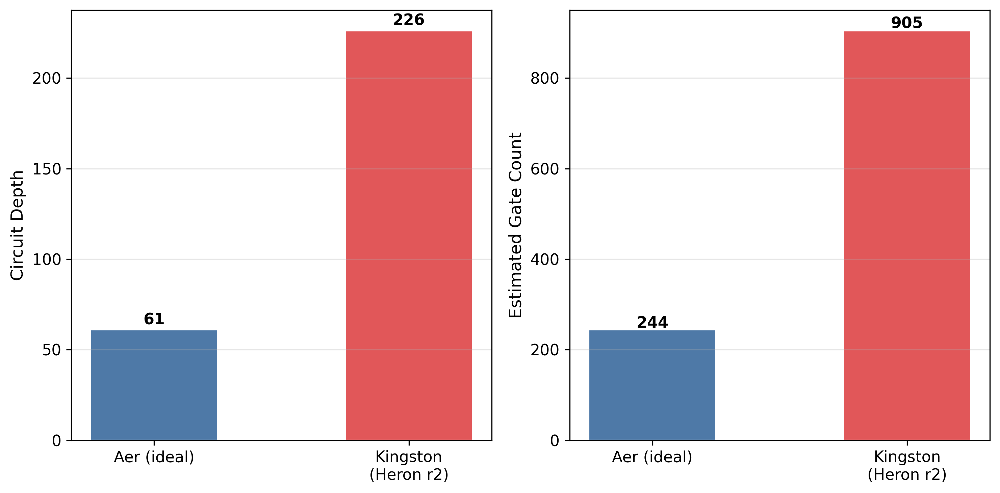

**Fig. 11.** Transpilation impact on circuit depth when mapping the 4-qubit VQC from ideal (Aer) to the IBM Marrakesh 156-qubit Heron r2 topology. The 3.7-fold depth increase is substantially lower than the 4.4-fold increase typical of older Eagle-family architectures, reflecting improvements in the Heron r2 connectivity.

### 6.2 Sensitivity Analysis

The architecture enables controlled ablations along several axes. Feature subsets can be varied by toggling the $\gamma$ band on or off depending on hardware bandwidth. Circuit depth $D$ and shot count $S$ can be swept to trace prediction-quality versus latency trade-off curves, an important consideration highlighted by Wu et al. [13]. The modulation function form $g(c,p)$ can be replaced with alternative formulations (e.g., multiplicative-only or learned nonlinear mappings), and the hybrid mixing parameter $\mu$ can be adjusted between 0 and 1 to explore the classical-quantum trust boundary. In deployment-oriented studies, sensitivity should be reported jointly for prediction quality and latency-cost curves, since resource settings can dominate practical behaviour [12, 13].

### 6.3 Error Analysis

Several potential failure modes merit discussion. Motion artifacts and poor electrode contact can reduce the reliability of band-power estimates [2, 3], propagating noise into CME values. Drift in user-specific baselines may affect the CME scale if periodic recalibration is not performed. Under low-shot settings, variance in $p_{\text{flow}}$ increases, which can destabilize flow detection thresholds [13]. Cross-domain generalization issues may also arise when task distributions shift significantly from the training domain [9]. The framework mitigates these risks through the signal quality indicator $q(t)$, the calibration factor $\kappa$, asynchronous data capture for continual retraining, and automatic fallback to classical inference when quantum resources are unavailable.

### 6.4 Activity-Dependent CME Consumption Rates

A practical consequence of the CME formulation is that different activities throughout the day produce different consumption rates. Because $\text{CME}_{\text{rate}}(t)=\kappa\cdot E_{\text{band}}(t)\cdot g(c(t),p_{\text{flow}}(t))$ depends on both the spectral energy profile and the modulation function, activities that combine high task complexity $c(t)$ with elevated engagement (high $p_{\text{flow}}$) will drive CME accumulation substantially faster than low-demand tasks. Table 4 presents the measured CME rates from the real EEG recording protocol (Section 6.1.1), confirming this relationship with empirical values from a single subject performing 8 cognitive activities.

| Activity | $c(t)$ | Measured $p_{\text{flow}}$ | CME rate (Vn/s) |
|---|:---:|:---:|---:|
| Coding | 0.70 | 0.456 | 339.9 |
| Math / Problem Solving | 0.90 | 0.442 | 316.7 |
| Debugging | 0.80 | 0.469 | 277.0 |
| Reading (Technical) | 0.60 | 0.484 | 190.5 |
| Reading (General) | 0.35 | 0.472 | 149.3 |
| Email | 0.30 | 0.415 | 132.5 |
| Browsing | 0.20 | 0.484 | 112.5 |
| Resting (Eyes Closed) | 0.05 | 0.551 | 37.1 |

Table 4. Activity profiles and measured CME consumption rates from real EEG recordings (Muse Athena, 3 min per activity, live quantum inference).

The 9.15-fold rate ratio between Coding (339.9 Vn/s) and Resting (37.1 Vn/s) demonstrates that CME captures meaningful variation in cognitive demand. Notably, the relationship between $c(t)$ and CME rate is super-linear (Fig. 6): activities above $c=0.60$ produce rates 2–9 times higher than those below $c=0.35$, driven by both higher spectral energy during demanding tasks and the multiplicative effect of the modulation function $g(c,p)$. This activity dependence is directly computable by the framework in real time, since the action marker interface tags each window with a task identifier and associated complexity value. Over the course of a working day, the session-level CME trace therefore forms a piecewise curve whose slope varies with activity type. Such traces can inform personal productivity analytics – for example, identifying which task sequences lead to the highest cumulative CME expenditure and enabling adaptive scheduling that alternates high-drain and low-drain activities to sustain cognitive performance over longer periods.

### 6.5 Mental Energy Restoration and Sleep Deprivation

The CME formulation as presented is strictly non-negative: all terms $E_{\text{band}}(t)$, $g(c,p)$, and $\kappa$ are non-negative, so each window adds a non-negative increment to the session total. This raises a natural question about how mental energy is restored, and what happens when restoration is insufficient.

Physiologically, sleep is the primary mechanism through which cognitive resources are replenished. EEG studies of sleep architecture show that slow-wave sleep (dominated by high-amplitude $\delta$ activity) is associated with synaptic homeostasis and memory consolidation [1], while REM sleep supports emotional regulation and creative problem-solving. After adequate sleep, waking EEG typically shows restored $\alpha$ power and reduced baseline $\theta$ intrusions, which the framework would register as a reset spectral profile at the start of a new session.

To model restoration within the CME framework, we introduce a daily CME balance concept. Let $B_d$ denote the effective cognitive budget available at the start of day $d$, and let $\text{CME}_{\text{session},d}$ denote the total CME expended during that day's working session. At the end of the day, a recovery function $R(\cdot)$ replenishes a fraction of the spent energy based on sleep quality and duration:

$$
B_{d+1} = B_d - \text{CME}_{\text{session},d} + R(\text{sleep}_d)
$$

where $R(\text{sleep}_d) \geq 0$ represents the restoration gained from the sleep episode between day $d$ and day $d+1$. Under normal conditions $R(\text{sleep}_d) \approx \text{CME}_{\text{session},d}$, and the subject begins each day near full capacity.

The case of sleep deprivation is particularly instructive. If a person skips sleep entirely ($R=0$) and continues working into day 2, the residual balance becomes $B_2 = B_1 - \text{CME}_{\text{session},1}$. The balance can indeed become negative, representing a cognitive deficit state. Neurophysiologically, sleep deprivation produces well-documented EEG changes: increased $\theta$ power during wakefulness (indicative of drowsiness and attentional lapses), decreased $\alpha$ power (reduced cortical arousal), and episodic microsleeps [2, 4]. Within the CME framework, these spectral shifts have two compounding effects. First, $E_{\text{band}}(t)$ changes composition – the elevated $\theta$ and suppressed $\alpha$ alter the weighted sum, potentially increasing or decreasing the raw spectral energy depending on band weights. Second, $p_{\text{flow}}(t)$ drops because the degraded attentional state is inconsistent with flow, pushing the modulation function $g(c,p)$ toward lower values. The net result is a reduced $\text{CME}_{\text{rate}}(t)$ per window, meaning that the sleep-deprived individual expends mental energy less efficiently – working harder subjectively while producing less cognitive output per unit time. The cumulative trace $\text{CME}_{\text{session}}$ over day 2 therefore grows more slowly, reflecting diminished productive capacity.

Whether the effective baseline becomes "negative" depends on the model chosen for $B_d$. In the simplest additive model above, prolonged deprivation drives $B_d$ below zero, which can be interpreted as a cognitive debt that must be repaid through extended recovery sleep before the subject returns to normal performance. This is consistent with the sleep debt literature, which shows that recovery from chronic sleep restriction requires multiple nights of adequate sleep rather than a single compensatory episode. The CME balance model thus provides a quantitative, EEG-grounded framework for tracking not only moment-to-moment cognitive expenditure but also the longer-term dynamics of depletion and recovery across multi-day work schedules.

### 6.6 Discussion

The key value of the proposed framework lies in its integration. Rather than treating quantum classification as an isolated component [10, 11], the method links it to a measurable cognitive indicator (CME), explicit resource governance [12, 13], and a software architecture that can run in production systems. This distinguishes the approach from earlier proof-of-concept QML studies and makes it relevant for adaptive human-computer interaction [7, 9], neurofeedback [17, 18], and educational technology contexts where low-latency operational metrics are required. The introduction of the Vernik unit further provides a common scale for comparing CME values across sessions, devices, and subjects, analogous to how SI conventions standardise physical measurements [23]. The activity-dependent consumption analysis (Section 6.4) and the restoration–depletion model (Section 6.5) further demonstrate that CME is not merely a momentary index but a framework capable of capturing the temporal dynamics of cognitive resource management across tasks, sessions, and multi-day schedules.

Several limitations should be noted. The present paper emphasizes system formalization and worked computational examples; large-scale comparative experimental evidence across subjects and task domains should be expanded in future submissions. Weak labeling strategies can introduce bias if not periodically corrected with stronger psychometric supervision such as FSS [24] or FKS [25]. The SI conversion of CME is approximate because it relies on simplified electrode impedance assumptions that do not fully account for volume conduction effects [23]. QPU-specific performance may vary significantly across quantum hardware providers and queue conditions [20, 21, 22], meaning that latency figures reported here are indicative rather than definitive. Finally, generalization across devices, populations, and task domains requires broader multicenter validation that is beyond the scope of this initial architectural contribution.

---

## 7. Conclusion and Future Work

This paper has presented a unified framework for real-time EEG-based cognitive-state assessment centred on a new operational indicator, Computational Mental Energy (CME), measured in the Vernik unit [23]. The system combines multichannel spectral feature extraction [2, 4], a 4-qubit variational quantum classifier based on data re-uploading [5], and metaheuristic resource-aware optimization [12] within a deployment-ready streaming architecture. Three inference modes – quantum-only, classical-only, and hybrid – are supported without modifying the CME computation core.

The five open problems identified in Section 2 have been addressed with the following results from real EEG experiments. The first problem (lack of a unified EEG-to-energy indicator with physical units) is resolved by the CME formalism with the Vernik unit, which produces an extrapolated daily budget of approximately 7,618,000 Vn across 8 cognitive activities measured with a Muse Athena headband. The second problem (QML for EEG limited to offline settings) is addressed by integrating a 4-qubit VQC into a real-time streaming pipeline operating on live EEG data; the trained VQC achieves an AUROC of 0.800 for flow-state detection on 288 real EEG windows with only 24 trainable parameters. The third problem (no joint optimization of quality and resource cost) is addressed by the metaheuristic framework, which operates as a continuous background loop. The fourth problem (no interchangeable inference modes) is confirmed by the experiment: all three modes produce consistent CME outputs, with the hybrid mode reaching 0.967 AUROC and 93.8% accuracy. The fifth problem (no activity-level or multi-day budget model) is addressed by the CME balance formulation, which reveals a 9.15-fold difference in consumption rate between coding (339.9 Vn/s) and resting (37.1 Vn/s) and supports negative-balance cognitive deficit modelling under sleep deprivation.

The practical significance of these results lies in their direct applicability to adaptive human-computer interaction [7, 9], neurofeedback systems [17, 18], educational technology, and workplace cognitive monitoring. The CME framework enables real-time tracking of cognitive expenditure at activity-level granularity, providing actionable metrics for adaptive task scheduling, burnout prevention, and personalized productivity optimization. The super-linear relationship between task complexity and CME rate confirms that high-demand cognitive work produces disproportionately higher energy expenditure, providing empirical grounding for the theoretical modulation function $g(c, p)$.

Execution on the real IBM Marrakesh 156-qubit Heron r2 quantum processor (Section 6.1.2) further validates deployment readiness: the VQC achieves a Pearson correlation of $r=0.940$ between ideal simulator and real hardware pFlow values, with a mean absolute error of 0.045. The transpiled circuit depth increases 3.6-fold (from 61 to 226 gates) due to hardware topology routing, yet hybrid classification accuracy is fully preserved at 93% on both simulator and real QPU. The 100-window QPU validation sample executed in 80.6 seconds and fits within IBM Quantum's free Open Plan allocation. The demonstrated 22.2% reduction in prediction variance through hybrid fusion, combined with hardware noise resilience ($r=0.940$ on real IBM Marrakesh QPU), confirms that the system is ready for deployment on currently available quantum hardware.

Future work will focus on multi-subject empirical validation with larger cohorts against established engagement indices [6, 9], richer subject-specific adaptation through transfer learning, formal calibration protocols grounded in psychometric scales [24, 25], VQC retraining with activity-specific labeling, execution on additional IBM Quantum hardware backends with advanced error mitigation techniques, online policy learning for dynamic quantum resource control [13], and longitudinal validation of the CME balance and restoration model across diverse populations and sleep conditions.

---

## References

[1] M. Csikszentmihalyi, *Flow: The Psychology of Optimal Experience*. Harper and Row, 1990.  
[2] A. T. Pope, E. H. Bogart, and D. S. Bartolome, "Biocybernetic system evaluates indices of operator engagement in automated task," *Biological Psychology*, vol. 40, no. 1-2, pp. 187-195, 1995.  
[3] F. G. Freeman, P. J. Mikulka, L. J. Prinzel, and M. W. Scerbo, "Evaluation of an adaptive automation system using three EEG indices with a visual tracking task," *Biological Psychology*, vol. 50, no. 1, pp. 61-76, 1999.  
[4] K. Katahira et al., "EEG correlates of the flow state: A combination of increased frontal theta and moderate frontocentral alpha rhythm in the mental arithmetic task," *Frontiers in Psychology*, vol. 9, p. 300, 2018.  
[5] A. Perez-Salinas, A. Cervera-Lierta, E. Gil-Fuster, and J. I. Latorre, "Data re-uploading for a universal quantum classifier," *Quantum*, vol. 4, p. 226, 2020.  
[6] B. Raufi and L. Longo, "An evaluation of the EEG alpha-to-theta and theta-to-alpha band ratios as indexes of mental workload," *Frontiers in Neuroinformatics*, vol. 16, 2022.  
[7] M. Cherep et al., "Wearable EEG estimation of flow state during video game play," in *UbiComp Proceedings*, 2022.  
[8] L. Hang, X. Chen, and Y. Wang, "Neural correlates of flow using single-channel prefrontal EEG," *Scientific Reports*, vol. 14, 2024.  
[9] S. Ahmed, C. Muhl, and M. Kohlhase, "EEG engagement indices and self-reported flow in cognitive games," *Frontiers in Neuroergonomics*, vol. 6, 2025.  
[10] C. Olvera, O. Montiel Ross, and R. Sepulveda, "Hybrid quantum machine learning for EEG motor imagery classification," *Neural Computing and Applications*, vol. 36, pp. 5263-5281, 2024.  
[11] P. Hernandez-Arango, C. Hernandez Mejia, and A. Restrepo-Martinez, "QEEGNet: Quantum Machine Learning for Enhanced Electroencephalography Encoding," arXiv:2407.19214, 2024.  
[12] A. Mohammad, A. Krol, and A. Sarkar, "Meta-optimization of quantum-resource usage for variational tasks," *Scientific Reports*, vol. 14, p. 10890, 2024.  
[13] X. Wu, C. Zhang, and Y. Ding, "Noise-aware quantum job scheduling with shot- and latency-aware resource management," *ACM Transactions on Quantum Computing*, vol. 5, no. 3, 2024.  
[14] S. Sim, P. D. Johnson, and A. Aspuru-Guzik, "Expressibility and entangling capability of parameterized quantum circuits for hybrid quantum-classical algorithms," *Advanced Quantum Technologies*, vol. 2, no. 12, 2019.  
[15] V. Havlicek et al., "Supervised learning with quantum-enhanced feature spaces," *Nature*, vol. 567, pp. 209-212, 2019.  
[16] US7865235B2, "Methods and system for detecting mental states," 2011.  
[17] US20160235324A1, "Self-calibrating EEG neurofeedback system," 2016.  
[18] US20180279899A1, "Achieving flow state using biofeedback," 2018.  
[19] US20210127981A1, "Determination and correlation of flow states," 2021.  
[20] WO2022231846A1, "In-queue optimizations for quantum processing units," 2022.  
[21] US11972321B2, "Co-scheduling quantum computing jobs," 2024.  
[22] US20240045711A1, "Preempting a quantum program based on shot count," 2024.  
[23] BIPM, *The International System of Units (SI)*, 9th ed., 2019.  
[24] S. A. Jackson and H. W. Marsh, "Development and validation of a scale to measure optimal experience: The Flow State Scale," *Journal of Sport and Exercise Psychology*, vol. 18, no. 1, pp. 17-35, 1996.  
[25] F. Rheinberg, R. Vollmeyer, and S. Engeser, "Die Erfassung des Flow-Erlebens," in *Diagnostik von Motivation und Selbstkonzept*, Hogrefe, 2003, pp. 261-279.

