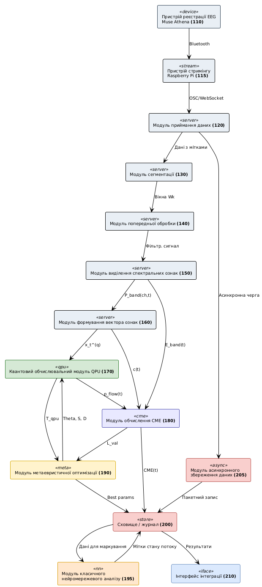

# Фіг. 1 – Загальна структурна схема системи

Загальна структурна схема системи обробки багатоканальних EEG-даних для обчислення показника обчислювальної ментальної енергії (CME).

Позиції: 100 – система; 110 – пристрій реєстрації EEG (Muse Athena); 115 – пристрій стримінгу (Raspberry Pi); 120 – модуль приймання даних на сервері; 130 – модуль сегментації; 140 – модуль попередньої обробки; 150 – модуль виділення спектральних ознак; 160 – модуль формування вектора ознак; 170 – квантовий обчислювальний модуль; 180 – модуль обчислення CME; 190 – модуль метаевристичної оптимізації; 195 – модуль класичного нейромережевого аналізу; 200 – сховище/журнал; 205 – модуль асинхронного збереження даних; 210 – інтерфейс інтеграції. Стрілки: 110 → 115 (Bluetooth), 115 → 120 (мережа), 120 → 205 (асинхронна черга), 200 → 195 (дані для маркування).

