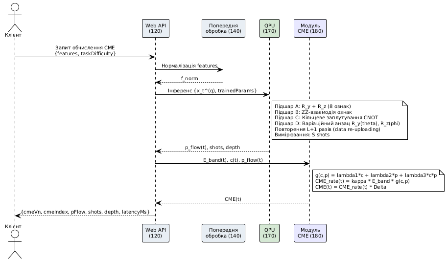

# Фіг. 2 – Потік даних для онлайн-обчислення CME у вікнах $\Delta$

Діаграма послідовності операцій для обчислення $\text{CME}(t)$ для одного вікна в онлайн-режимі (потік даних від клієнта через модулі системи до повернення результату).

