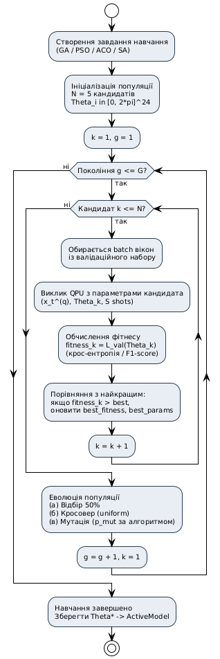

# Фіг. 3 – Контур метаевристичної оптимізації

Діаграма ітераційного циклу метаевристичної оптимізації параметрів квантової моделі та ресурсних режимів (shots, глибина). Реалізовано у фоновому модулі метаевристичної оптимізації (190).

