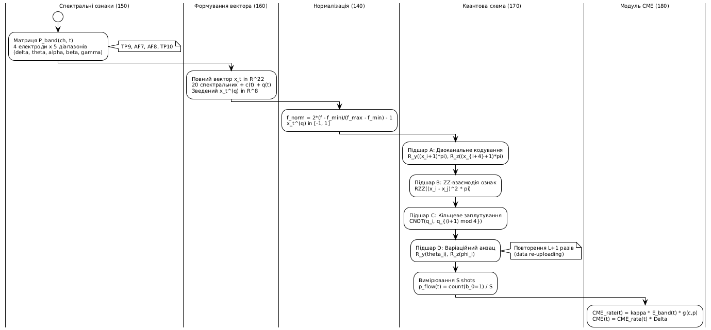

# Фіг. 4 – Структура спектральних ознак по електродах та діапазонах частот

Приклад структури спектральних ознак для одного вікна $\Delta$. Ілюстрація формування вектора $\mathbf{x}_t$ із потужностей $\delta/\theta/\alpha/\beta/\gamma$ для кожного каналу та додаткових метаданих, з подальшою нормалізацією та кодуванням у квантову схему.

## Числовий приклад для одного вікна

| Електрод | $\delta$ (1-4 Гц) | $\theta$ (4-8 Гц) | $\alpha$ (8-13 Гц) | $\beta$ (13-30 Гц) | $\gamma$ (30-45 Гц) |
|----------|:---:|:---:|:---:|:---:|:---:|
| TP9      | 0.9821 | 0.2756 | 0.4012 | 0.1345 | 0.0623 |
| AF7      | 1.0795 | 0.3091 | 0.3864 | 0.1206 | 0.0578 |
| AF8      | 1.1234 | 0.2987 | 0.3956 | 0.1289 | 0.0612 |
| TP10     | 0.9567 | 0.2834 | 0.4123 | 0.1398 | 0.0645 |

Додаткові поля:
- $c(t) = 0.62$ (індекс складності задачі)
- $q(t) = 0.93$ (якість сигналу)
- $\Delta = 5$ с (тривалість вікна)
